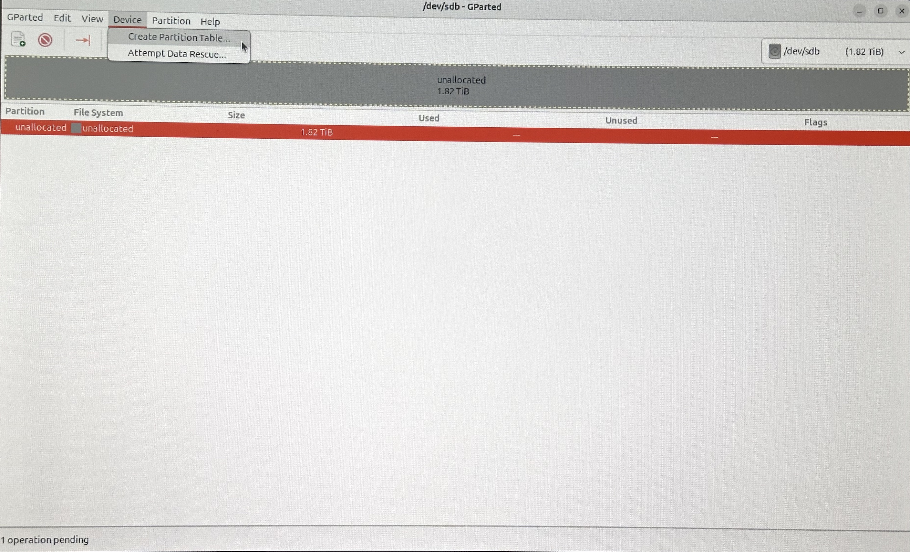

In this article, we'll explore installing Linux Ubuntu 24.04 LTS on an external SSD. When might this be necessary? Suppose you have a laptop or a desktop PC with Windows installed, with disks/partitions already quite full. Furthermore, suppose you need to work in Linux, for example, with Software Defined Radio, writing Linux drivers for high-speed interfaces (PCIe, 10G+ Ethernet, etc.), ASIC design, or another specific task. Running these in a virtual machine might be slower or significantly more complicated, requiring additional workarounds. For instance, I needed Linux to work with a budget-friendly ($15-75) FPGA board [Storey Peak,](https://j-marjanovic.io/stratix-v-accelerator-card-from-ebay-part-7.html) which required specific configuration through openocd, data exchange via PCIe, etc. In such situations, it's much simpler to install Linux on a separate fast SSD, which can also be used with different laptops/PCs.

As I couldn't find a detailed article online that covered all the important points, I'll describe my own experience below.

Linux will be installed on a Western Digital Black SN850X 2TB NVMe M.2 2280 PCIe 4.0 x4 (WDS200T2X0E) drive, housed in an external Asus TUF Gaming A1 M.2 SSD NVME Enclosure USB 3.2 Type-C (ESD-T1A/BLK/G/AS).

This guide is intended for new systems with [UEFI](https://en.wikipedia.org/wiki/UEFI)/[ESP](https://en.wikipedia.org/wiki/EFI_system_partition) and will not work on old systems that use BIOS/MBR. In other words, Linux on an external SSD needs to be installed on a laptop/PC with UEFI/ESP support and booted from the created disk on a laptop/PC with UEFI/ESP. This is not actually a problem, as the vast majority of laptops/PCs now use UEFI rather than the outdated BIOS.

The desired result is to create a portable SSD with Linux, not tied to any specific hardware configuration, that can be booted on any laptop/PC with UEFI support.

# Choosing a Linux Distribution

I chose Ubuntu as I have the most experience with it, and it has the necessary tools for working with DSP/SDR/FPGA (my specialization). Just before writing this guide, Ubuntu 24.04 LTS was released, so I decided to test it immediately. When a new version is released that includes interesting updates (say in the direction of io_uring), I will update.

[Link](https://ubuntu.com/download/desktop/thank-you?version=24.04&architecture=amd64&lts=true) to download the Ubuntu 24.04 LTS disk image.

It is important to ensure that the downloaded disk image does not contain bit errors. To be sure, you can calculate the hash of the disk image and compare it with the expected value.

You can view the expected hash of the disk image [here](https://releases.ubuntu.com/24.04/). In my case, it was `81fae9cc21e2b1e3a9a4526c7dad3131b668e346c580702235ad4d02645d9455`.

Calculate the hash of the disk image in Windows PowerShell as follows:

```powershell
PS C:\Users\ekoro\Downloads> Get-FileHash -Path ".\ubuntu-24.04-desktop-amd64.iso" -Algorithm SHA256
Algorithm    Hash                                  Path
---------    ----                                  ----
SHA256       81FAE9CC21E2B1E3A9A4526C7DAD3131B668E346C580702235AD4D02645D9455
```
It matched :)

# Writing the Linux Distribution Image to a USB Stick

It is highly recommended to use a relatively new USB stick to minimize the risk of writing errors and related issues during the installation of Linux (personally, I haven't encountered such problems, but I've seen complaints on the internet). A new USB stick also typically has a higher write/read speed, which can make the installation process faster.

On Windows, the easiest way to create a USB stick for installing Linux is to use Rufus, which can be downloaded from the [Rufus website](https://rufus.ie) or installed from the Microsoft Store. I used version 4.4.2103.

There is a [detailed guide](https://ubuntu.com/tutorials/create-a-usb-stick-on-windows#1-overview) on how to use Rufus, but in case it's unavailable, I will describe the necessary steps below with screenshots.

Start Rufus, select the disk (USB stick) and the installation disk image of Ubuntu. Leave most of the settings at their default values. It is very important to ensure that you have selected the correct installation USB stick to avoid accidentally writing the image over any of your system disks, deleting valuable data.


A subsequent window will pop up, agree to the default setting:


If Rufus does not contain the necessary bootloader Grub, it will offer to download it from the internet:


Press the Start button, and you will be warned that all data on the disk will be deleted:


Press OK and in a few minutes, the disk image will be written to the USB stick.

# Booting Live Linux from the Installation USB

Before beginning the installation of Linux, certain manipulations with the disks are best done using GParted. To do this, you need to boot Live Linux from the installation USB (choose the "try Ubuntu" option). It seems straightforward, but there's a nuance. After selecting the USB in the UEFI boot menu and then choosing "try Ubuntu," the system crashed with a message like "Oh no! Something has gone wrong. A problem has occurred and the system can't recover," etc. Pressing `Ctrl+Alt+F3` didn't help. Internet searches didn't yield much. The only thing I found was that this problem has been occurring for a long time, mainly at the release update stage and involves the graphical subsystem. I suspected bugs in the 24.04 release, a corrupted image, or a faulty USB stick, but the problem was elsewhere. It turned out that the issue occurred when connecting a monitor to the Display Port of a GeForce RTX 3070. When connected via HDMI to a discrete or integrated graphics card, everything worked perfectly.

# Disk Partitioning Operations

Finally, we get to the crux. First, we need to create partitions on the external SSD. Second, it is necessary to modify (for the installation process) the ESP flags of the laptop/PC's disk.

> [!NOTE]
> When working with Live Linux, I initially forgot that screenshots could be taken there too. Therefore, I took photos of the windows. They didn't turn out as aesthetically pleasing as they could have been if I had taken screenshots :(

Why modify the ESP partition of the laptop/PC?

Many Linux distributions during installation will install the Grub bootloader to the first ESP partition they find, which is usually the ESP partition of the laptop/PC. As a result, Linux on the SSD becomes tied to the laptop/PC on which the installation was performed, creating a typical dual-boot configuration. Linux on the external SSD will not boot on another laptop/PC, and if the external SSD is disconnected, you will encounter a boot error on the laptop/PC where the ESP partition was modified. In other words, this does not create a fully portable Linux, which can be booted on any laptop/PC that supports UEFI.

In some Ubuntu releases during installation, it is possible to choose which ESP partition to install Grub on, but according to reviews, this option does not always work, and many [steps](https://www.58bits.com/blog/2020/02/28/how-create-truly-portable-ubuntu-installation-external-usb-hdd-or-ssd) have to be taken to restore the status quo (removing the Linux bootloader from the main ESP partition and installing it on the ESP partition of the external SSD).

How can this problem be solved? Well, one could physically disconnect the native disk (disks) of the laptop/PC during the Linux installation. To me, this is a bad solution, inconvenient, and often impossible to implement (if, say, the PC case is sealed).

Another option is to disable the disks in the UEFI settings. Some systems allow this, for example, Dell:


On my PC with an Asus motherboard, unfortunately, this is not an option. However, there remains one adequate alternative - to remove the esp/boot flags from the main ESP partition during the installation of Linux and restore them afterward. Let's look at how to do this below.

So, boot from the installation USB, choose "Try Ubuntu", after loading Live Ubuntu open GParted, select the main disk on which Windows is installed. Before performing operations in GParted, it is very important to check which disk you are operating on (to accidentally not delete data on other disks).


We see that on the main disk there is an ESP partition of 128 MB with FAT32 and boot/esp flags. We need to remove these flags during the installation of Linux. To do this, right-click on the disk partition line and choose Manage Flags:


A window for setting partition flags opens. Remove the checkmarks from the esp and boot flags (this will automatically set the msftdata flag, which is normal):


After pressing Close, we see that the boot/esp flags have disappeared:


Next, select the external SSD in GParted (you can orient by the size of the disk).

If the external SSD is brand new, just out of the store, you can create a new GPT partition table on it:




Then confirm the selected action:


If there were already partitions on the disk, you can delete them (unmount the partition, delete the partition, and then again "Apply All Operations"):


Next, we create partitions. First, an ESP partition on the external SSD. This is a partition of 100 MB and FAT32:


Next, we create the main ext4 partition for the entire remaining volume of the disk. This partition will directly install Linux:


If desired, you can create a separate swap partition and select it during the Linux installation for the swap. I did not create a separate partition for swap. If you do not create a swap partition, Linux will create a swap file, the size of which is easier to change in Linux compared to implementing swap in a separate partition.

Now, set the boot/esp flags for the ESP partition of the external SSD:


# Installing Ubuntu

Now you can close GParted and start the installation of Ubuntu:


As we see, there is an option to select the partition for installing the bootloader. Currently, in all the disks, there is only one partition with boot/esp flags (namely the partition of the external SSD, since the ESP partition of the main disk had these flags removed). How it would work in the case of two active ESP partitions was not tested.


Set the mount point / for the partition in which we will install Linux:


As a result, it should look like this:


Then follows the classic installation of Ubuntu, nothing interesting.

After completing the installation of Ubuntu and rebooting, do not forget to run GParted (from the installation USB or the newly installed Ubuntu) and restore the boot/esp flags in the main ESP partition of the laptop/PC:


# Checking the Result

A reminder that our goal is to create a portable SSD with Linux, not tied to any specific system, that can be booted on any laptop/PC with UEFI support. To check the result, turn off the laptop/PC on which Ubuntu was installed on the external disk, disconnect the SSD, turn on the laptop/PC to ensure that Windows boots normally without the external disk. Then connect the external SSD to another laptop/PC with UEFI support and try to boot from the external disk (for this, of course, you need to select UEFI boot from the external disk in the boot menu). If the boot does not start immediately, check the UEFI settings to see if Thunderbolt is enabled at the boot stage and if booting from USB via Thunderbolt is allowed.