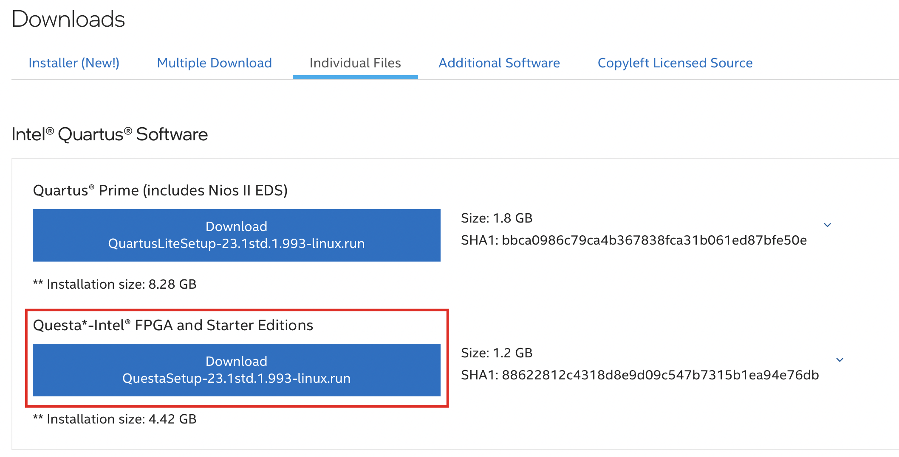
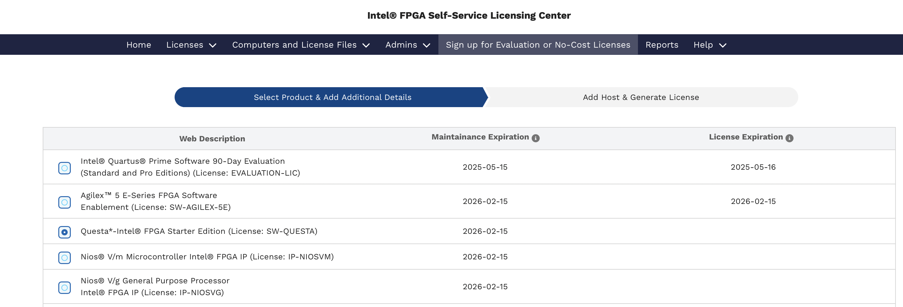

Below, I'll describe the sequence of steps for simulating the Pulpissimo System-on-Chip (SoC) from the PULP project.

The installation is performed on Ubuntu 24.04.2 LTS. Python version: 3.12.3. GCC version: 13.3.0.

# Installing the QuestaSim Simulator

Download the QuestaSim Intel FPGA Starter Edition for Linux from [this link](https://www.intel.com/content/www/us/en/software-kit/825277/intel-quartus-prime-lite-edition-design-software-version-23-1-1-for-linux.html). I used version 23.1.1. You can download and install QuestaSim separately, or you can download the entire Quartus Lite package, which includes QuestaSim. I installed it together with Quartus Lite, but the standalone Intel QuestaSim should also work.



The installation process is generally straightforward. One caveat to note is that QuestaSim cannot be installed on ARM Linux under Apple Silicon using Parallels. It must be an x86 Linux system.

The next step is to generate a license for QuestaSim from Intel/Altera.

Go to the [Intel® FPGA Self Service Licensing Center](https://licensing.intel.com/psg/s/?language=en) on Intel's website.


If you are accessing the licensing center for the first time, choose "Enroll"; otherwise, select "Sign In."


Then, select [Sign up for Evaluation or No-Cost Licenses](https://licensing.intel.com/psg/s/sales-signup-evaluationlicenses).


Choose "Questa*-Intel® FPGA Starter Edition (License: SW-QUESTA)" and click "Next" at the bottom.



Check the necessary boxes, select the computer for which the license is being generated, and click "Generate."


If no computer is registered, click "+New Computer." Choose the license type, enter the MAC address of the network card, and click "Save."


The license will be sent to the email address you used to register on Intel's portal.

In the `.bashrc` file, add the path to the license file in the `LM_LICENSE_FILE` environment variable and add the QuestaSim binaries to `PATH`:

```bash
export PATH=$PATH:/home/ekorotkyi/intelFPGA_lite/23.1std/questa_fse/bin
export LM_LICENSE_FILE="/home/ekorotkyi/intelFPGA_lite/23.1std/questa_fse/license/LR-218640_License.dat"
```

Save `.bashrc` and restart the computer. To launch QuestaSim, run `vsim` in the terminal. If everything is set up correctly, the QuestaSim window should open without errors.


# Directory Structure

To simulate the Pulpissimo SoC from the PULP project, you will need to install:

1. The RISC-V GNU Toolchain (https://github.com/pulp-platform/riscv-gnu-toolchain)
2. The PULPissimo SoC repository (https://github.com/pulp-platform/pulpissimo)
3. Example programs (https://github.com/pulp-platform/pulp-runtime-examples)

All of these can be installed in a single directory named "PULP."


# Installing the RISC-V GNU Toolchain

Clone the toolchain repository recursively (including submodules):

```bash
git clone --recursive https://github.com/pulp-platform/riscv-gnu-toolchain.git
```

Install required libraries:

```bash
sudo apt-get install autoconf automake autotools-dev curl python3 libmpc-dev libmpfr-dev libgmp-dev gawk build-essential bison flex texinfo gperf libtool patchutils bc zlib1g-dev libexpat-dev
```

Additionally, install:

```bash
sudo apt install python3-argcomplete python3-pyelftools python3-prettytable python3-numpy
```

Set the `PULP_RISCV_GCC_TOOLCHAIN` environment variable to specify the installation path for the compiled toolchain and add it to `PATH`. Modify `.bashrc` accordingly:

```bash
export PULP_RISCV_GCC_TOOLCHAIN=/home/ekorotkyi/projects/pulp/riscv-gcc-toolchain
export PATH=$PULP_RISCV_GCC_TOOLCHAIN/bin:$PATH
```

Configure the toolchain in its directory:

```bash
./configure --prefix=$PULP_RISCV_GCC_TOOLCHAIN --with-arch=rv32imfcxpulpv3 --with-abi=ilp32 --enable-multilib
```

Compile the toolchain using `make`. The compilation takes 30-60 minutes. Speed up the process by specifying the number of threads:

```bash
make -j16
```

# Compiling PULPissimo

Clone the repository recursively:

```bash
git clone --recursive https://github.com/pulp-platform/pulpissimo.git
```

Fetch submodules using Bender:

```bash
make checkout
```

Select the target processor for software drivers:

```bash
cd sw/pulp-runtime
source configs/pulpissimo_cv32.sh
```

Compile the SoC for simulation and build the driver library:

```bash
cd ../..
make build
```

# Simulating PULP Runtime Examples

Clone the example repository:

```bash
git clone https://github.com/pulp-platform/pulp-runtime-examples.git
```

To run the simulation:

```bash
cd hello
make clean
make all
make run
```

To simulate in the QuestaSim GUI, use:

```bash
make run gui=1
```

The result:


