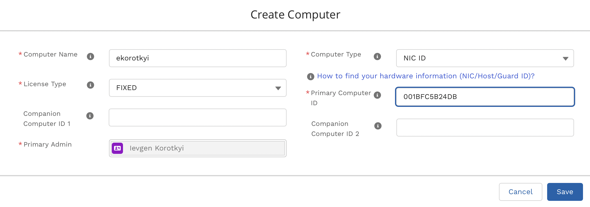
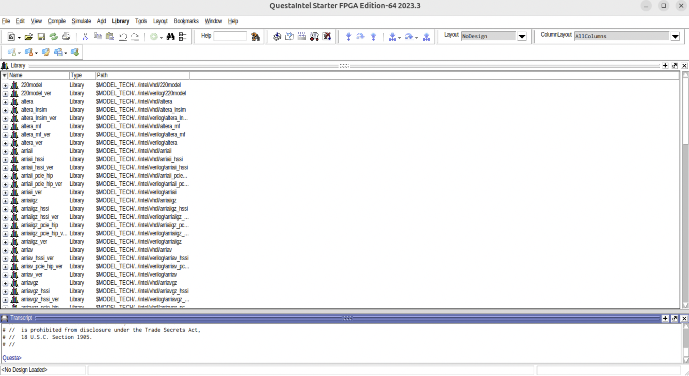

# Introduction

Below I describe how to build [pulp-sdk](https://github.com/pulp-platform/pulp-sdk) for the system-on-chip [Pulpissimo](https://github.com/pulp-platform/pulpissimo), compile examples for accelerating machine learning tasks from the [pulp-training](https://github.com/pulp-platform/pulp-training/) repository, and run a simulation in QuestaSim.

First, a few words about PULP.

[PULP](https://pulp-platform.org/projectinfo.html) (Parallel Ultra Low Power) is an open platform developed at ETH Zurich for creating energy-efficient system-on-chip designs for parallel computing based on RISC-V architecture processors. It is one of the best-known open source projects in the world, with over 50 [fabricated chips](https://pulp-platform.org/implementation.html). It offers the ability to add not only processor cores but also custom hardware accelerators. Both 32-bit and 64-bit RISC-V implementations are supported. Programming in C, C++, OpenMP, and OpenCL is available. It can run on bare metal, Linux, or FreeRTOS, and comes with ready-to-use tools for deploying neural networks.

Pulpissimo is a relatively simple single-processor system-on-chip that is a convenient starting point for exploring PULP. Pulpissimo can be run at the cycle-accurate/RTL simulation level as well as on an FPGA. It is a silicon-proven system with several fabricated ASIC chips.

In this article, we will see how to install the free version of QuestaSim (from Intel/Altera), build the Pulpissimo platform, and set up the RISC-V cross-compiler and SDK for application development. We will also demonstrate how to run a simulation in QuestaSim for an example program that performs a dot product on arrays, accelerated by the hardware extensions of the RISC-V processor.

> [!IMPORTANT]
>
> To install pulpissimo and pulp-sdk, which support the examples used in pulp-training, you need Python 2.7.17, Python 3.6.9, and gcc 5.5.0. The simplest installation is on Ubuntu 18. Therefore, all the following instructions are tailored for Ubuntu 18.

# Installing the QuestaSim Simulator

Download the QuestaSim Intel FPGA Starter Edition for Linux from [this link](https://www.intel.com/content/www/us/en/software-kit/825277/intel-quartus-prime-lite-edition-design-software-version-23-1-1-for-linux.html). In this case, version 23.1.1 is used. You can download and install QuestaSim separately, or download the entire Quartus Lite package which includes QuestaSim.


The installation process is straightforward. Note that it is not possible to install QuestaSim on ARM Linux under Apple Silicon in Parallels – it must be pure x86 Linux.

The next step is to generate a license for QuestaSim from Intel/Altera.

On the Intel website, go to the [Intel® FPGA Self Service Licensing Center](https://licensing.intel.com/psg/s/?language=en).


If you are accessing the Licensing Center for the first time, choose **Enroll**; otherwise, choose **Sign In**.


Next, select [Sign up for Evaluation or No-Cost Licenses](https://licensing.intel.com/psg/s/sales-signup-evaluationlicenses).


Select **Questa*-Intel® FPGA Starter Edition (License: SW-QUESTA)** and click **Next** at the bottom.


Check the boxes, select the computer for which the license is being generated, and click **Generate**.


If no computer has been added yet, click **+New Computer**. Select the license type, enter the MAC address of your network card, and click **Save**.



The license will be sent to the email address you registered with on the Intel portal.

In your `.bashrc` file, add the path to the license file in the `LM_LICENSE_FILE` environment variable, and also add the path to the QuestaSim binaries to your `PATH` (these must be full absolute paths, otherwise the license may not be picked up):

```bash
export PATH=$PATH:/home/pulp/intelFPGA/23.1std/questa_fse/bin
export LM_LICENSE_FILE=/home/pulp/intelFPGA/23.1std/questa_fse/license/LR-218640_License.dat
```

Save the `.bashrc` file and reboot your computer. To launch QuestaSim, run the command `vsim` from the terminal. If everything went according to plan, the QuestaSim window will open without errors.



# Installing pulpissimo and pulp-sdk

> [!IMPORTANT]
>
> Reminder that the installation is performed on Ubuntu 18.

Install and select gcc 5.5 for use:

```bash
sudo apt install gcc-5 g++-5

sudo update-alternatives --install /usr/bin/gcc gcc /usr/bin/gcc-5 100
sudo update-alternatives --install /usr/bin/g++ g++ /usr/bin/g++-5 100

sudo update-alternatives --config gcc
sudo update-alternatives --config g++
```

Verify that the versions of gcc and g++ are indeed 5.5:

```bash
gcc --version
g++ --version
```

It should show:


Install the dependencies:

```bash
sudo apt install git curl gawk python3-pip python-pip autoconf automake autotools-dev build-essential bison flex texinfo gperf libtool patchutils bc zlib1g-dev libgmp-dev libmpfr-dev libmpc-dev swig3.0 libjpeg-dev lsb-core doxygen python-sphinx sox graphicsmagick-libmagick-dev-compat libsdl2-dev libswitch-perl \
libftdi1-dev cmake scons libsndfile1-dev tcl

sudo pip3 install artifactory twisted prettytable sqlalchemy pyelftools 'openpyxl==2.6.4' xlsxwriter pyyaml numpy configparser pyvcd semver

sudo pip2 install configparser
```

We will install the RISC-V cross-compiler, pulpissimo, and pulp-sdk in the directory `~/pulp_box`:

```bash
cd ~
mkdir pulp_box
cd pulp_box
```

Recursively (with submodules) clone the pulp-riscv-gnu-toolchain (the RISC-V cross-compiler):

```bash
git clone --recursive https://github.com/pulp-platform/pulp-riscv-gnu-toolchain.git
```

Set the necessary environment variables in your `.bashrc`:

```bash
export PULP_RISCV_GCC_TOOLCHAIN=/home/pulp/pulp_box/pulp-riscv-gcc-toolchain
export PATH=$PULP_RISCV_GCC_TOOLCHAIN/bin:$PATH
```

After modifying `.bashrc`, restart the terminal.

Configure and compile the pulp-riscv-gnu-toolchain (the compilation is lengthy and may take 30–90 minutes):

```bash
cd pulp-riscv-gnu-toolchain/
./configure --prefix=$PULP_RISCV_GCC_TOOLCHAIN --with-arch=rv32imc --with-cmodel=medlow --enable-multilib
make
```

Install pulpissimo and pulp-sdk in the directory `~/pulp_box`:

```bash
cd ~/pulp_box
```

Clone pulpissimo and select the required release (which supports working with pulp-sdk):

```bash
git clone https://github.com/pulp-platform/pulpissimo.git
cd pulpissimo
git checkout v7.0.0
```

Compile pulp-sdk:

```bash
make build-pulp-sdk
```

Clone the pulpissimo components:

```bash
source env/pulpissimo.sh
make checkout
```

To work with the new version of QuestaSim, modify the file `sim/tcl_files/rtl_vopt.tcl` by replacing `vopt +acc=mnpr` with `vopt +acc`. The file should look like this:


Finally, compile pulpissimo:

```bash
make build
```

# Running Examples from the pulp-training Repository

Clone the [pulp-training](https://github.com/pulp-platform/pulp-training) repository containing examples for pulp-sdk into the `pulp_box` directory:

```bash
cd ~/pulp_box/
git clone https://github.com/pulp-platform/pulp-training.git
```

For demonstration, we will use the dot_product example.

First, open a terminal and initialize the pulp-sdk by running the pulpissimo.sh script (this script must be run every time you open a new terminal in which you plan to work):

```bash
source ~/pulp_box/pulpissimo/env/pulpissimo.sh
```

After running the script, the default target is the simulation in QuestaSim.

You can verify the simulation type by checking the environment variable `PULP_CURRENT_CONFIG_ARGS` (platform=rtl corresponds to the simulation in QuestaSim):

```bash
echo $PULP_CURRENT_CONFIG_ARGS
```


To use the software cycle-accurate simulator GVSoC (which may speed up simulation, although results may differ from running on the actual processor in QuestaSim), run the script:

```bash
source ~/pulp_box/pulpissimo/pulp-sdk/configs/platform-gvsoc.sh
```


To switch back to the QuestaSim simulation, run:

```bash
source ~/pulp_box/pulpissimo/pulp-sdk/configs/platform-rtl.sh
```


Navigate to the dot_product directory and execute:

```bash
cd ~/pulp_box/pulp-training/dot_product
make clean
make all
make run
```

You can also use a single command:

```bash
make clean all run
```

The `make clean` command removes previous compilation/simulation results.

The `make all` command compiles the program for the processor.


The `make run` command starts the simulation.

If successful, you will see a result like this:


The values highlighted in red in the image above are performance counters. Performance counters are hardware counters within pulpissimo that allow profiling (determining how many clock cycles the program took, how many instructions were executed, how many pipeline stalls occurred, etc.). More on performance counters is explained in the following section.

You can specify the simulation platform (GVSoC/QuestaSim) as an argument to `make run`.

For example, to run the simulation on the cycle-accurate GVSoC simulator (which may speed up simulation, although results may differ from running on the actual processor in QuestaSim):

```bash
make run platform=gvsoc CORE=4
```


The `CORE` argument allows you to set the number of processor cores on your machine that will be used for the simulation.

Alternatively, you can run the simulation in QuestaSim by explicitly specifying the `rtl` platform:

```bash
make run platform=rtl CORE=4
```


It is also possible to launch the simulation with a graphical interface in QuestaSim:

```bash
make run gui=1
```

After executing the command, the simulator window will open, but the simulation will not start automatically. To start the simulation, click the `Run All` button or type `run -all` in the QuestaSim command line.


While in the example directory, you can disassemble the program with the command (the disassembly result is saved to the file `dis.s`):

```bash
make dis > dis.s
```


The file `/home/pulp/pulp_box/pulp-training/dot_product/build/pulpissimo/trace_core_1f_0.log` will contain the execution trace with timestamps from the simulator:


# Description of Performance Counters in pulp-sdk

Performance counters are hardware counters inside pulpissimo (accessed via software in pulp-sdk) that allow profiling (determining how many clock cycles the program took, how many instructions were executed, how many pipeline stalls occurred, etc.).

The output of performance counters for the dot_product example at the end of program execution looks like this:


Explanation:

- **cycles** → the number of system clock cycles elapsed since the performance counters were started
- **instructions** → the number of instructions executed by the processor since the performance counters were started
- **load stalls** → the number of pipeline stalls (since the performance counters were started) caused by an instruction using a register value that has not yet been fetched from data memory
- **jump stalls** → the number of pipeline bubbles (since the performance counters were started) due to the execution of unconditional branch instructions
- **instruction stalls** → the number of pipeline stalls (since the performance counters were started) resulting from fetching instructions that are not aligned on a 4-byte boundary (this situation can occur when using compressed instructions)

More about performance counters (and a bit about pipeline stalls) can be read [here](https://pulp-platform.org/docs/riscv_workshop_zurich/schiavone_wosh2019_tutorial.pdf) (slide “Performance Counter 1/3”), and in the pulp-sdk documentation (file `file:///home/pulp/pulp_box/pulpissimo/pulp-sdk/doc/dox/doc/runtime/html/group__Perf.html`).

Example of using performance counters:

```c
    rt_perf_t *perf;
    perf = rt_alloc(RT_ALLOC_L2_CL_DATA, sizeof(rt_perf_t));

    rt_perf_init(perf);
    rt_perf_conf(perf, (1<<RT_PERF_ACTIVE_CYCLES) | (1<<RT_PERF_INSTR) | (1<<RT_PERF_LD_STALL) | (1<<RT_PERF_JR_STALL) | (1 << RT_PERF_IMISS));

    rt_perf_reset(perf);

    // Start the monitoring
    rt_perf_start(perf);

    // Some code execution here....

    // Stop the hardware counter used for monitoring
    rt_perf_stop(perf);

    // Get the total measurement
    rt_perf_save(perf);

    instr   = rt_perf_get(perf, RT_PERF_INSTR);
    cycles  = rt_perf_get(perf, RT_PERF_ACTIVE_CYCLES);
    ldstall = rt_perf_get(perf, RT_PERF_LD_STALL);
    jrstall = rt_perf_get(perf, RT_PERF_JR_STALL);
    imstall = rt_perf_get(perf, RT_PERF_IMISS);

    printf("Perf of dot product: \n \t cycles : %d \n \t instructions : %d \n \t load stalls : %d \n \t jump stalls : %d \n \t instruction stalls: %d \n\n",
           cycles, instr, ldstall, jrstall, imstall);
```

Different types of the performance counters:


# Using Inline Assembler for Pulpissimo

In the pulp-training examples, the main program is written in C for convenience. The key computations, however, are implemented in RISC-V assembly (to demonstrate how RISC-V extensions can be used to optimize programs).

Assembly code in C programs is used via inline assembly and the keyword `asm`.

To allow the inline assembly code to access C program variables (so that, for example, the assembly code can modify C variables), the following approach is used:

```c
unsigned int dotproduct(unsigned int acc, unsigned char* vA, unsigned char* vB, unsigned int N)
{
    unsigned char elemA, elemB;
    // .. Some code here 
    asm volatile(
        "lp.setup x0,%[n_elem],stop_loop;"
        "p.lbu %[a], 1(%[addrA]!);"
        "p.lbu %[b], 1(%[addrB]!);"
        "stop_loop: p.mac %[c], %[a], %[b];"
        : [c] "+r" (acc), [a] "+r" (elemA), [b] "+r" (elemB), [addrA] "+r" (vA), [addrB] "+r" (vB) : [n_elem] "r" (N)
    );
    // .. Some code here 
}
```

The `volatile` qualifier prevents the compiler from optimizing the specified assembly code.

The construct `[c] "+r" (acc)` binds the C variable (in this case, `acc`) to a symbolic name used in the assembly code (here, the symbolic name is `c`).

The `"+r"` indicates that the corresponding C variable should be stored in a processor register. The `+` sign indicates that the variable may be both read and written.

To access a register with a given symbolic name in the assembly code, the construction `%[asmSymbolicName]` is used. For example, in the instruction `p.lbu %[a], 1(%[addrA]!);`, a byte of data from the memory cell at the address stored in the register with the symbolic name `addrA` (which holds the pointer `vA` from the C code) is loaded into the register with the symbolic name `a` (corresponding to the C variable `acc`).

More about inline assembly can be read [here](https://gcc.gnu.org/onlinedocs/gcc/Extended-Asm.html).

# Useful Links

Finally, here are a few useful links. Good luck mastering PULP!

1. [PULPissimo Datasheet](https://github.com/pulp-platform/pulpissimo/blob/master/doc/datasheet/datasheet.pdf)
2. [RI5CY User Manual](https://pulp-platform.org/docs/ri5cy_user_manual.pdf) (RI5CY is the processor core of Pulpissimo)
3. [pulp-sdk Tutorial](https://pulp-platform.org/docs/pulp_training/NBruschi_gvsoc_tutorial_part1.pdf)
4. [PULP Tutorial](https://pulp-platform.org/docs/riscv_workshop_zurich/schiavone_wosh2019_tutorial.pdf)
5. [Article about PULP "Near-Threshold RISC-V Core With DSP Extensions for Scalable IoT Endpoint Devices"](https://arxiv.org/pdf/1608.08376)
