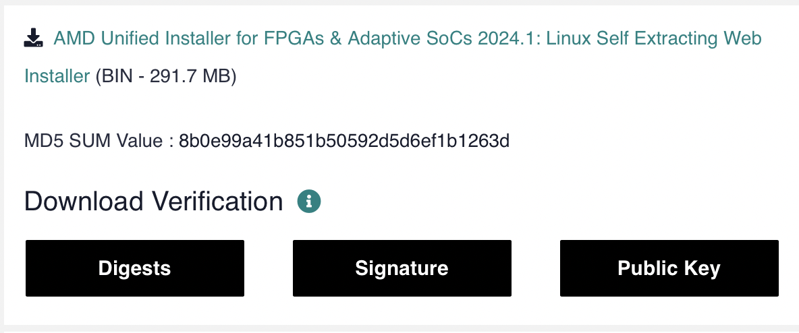
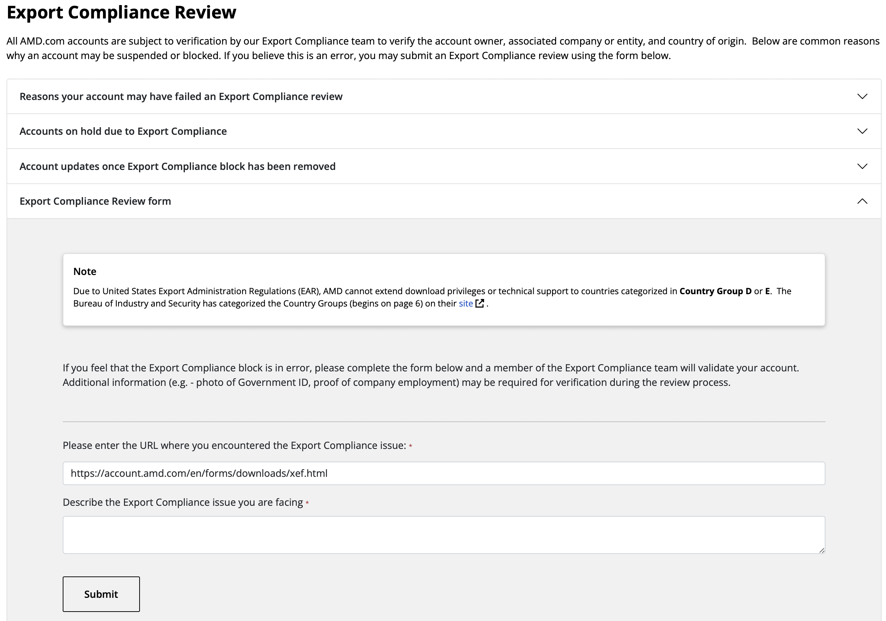
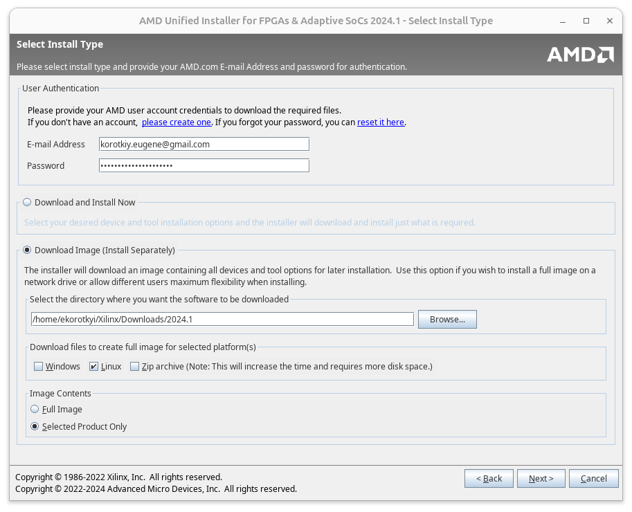
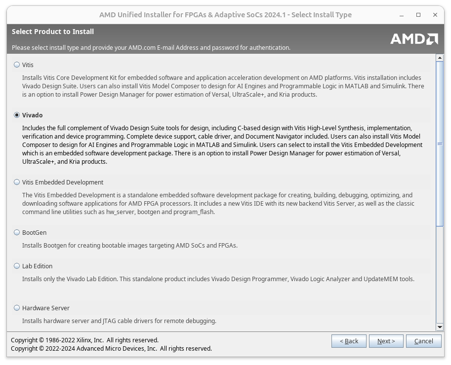
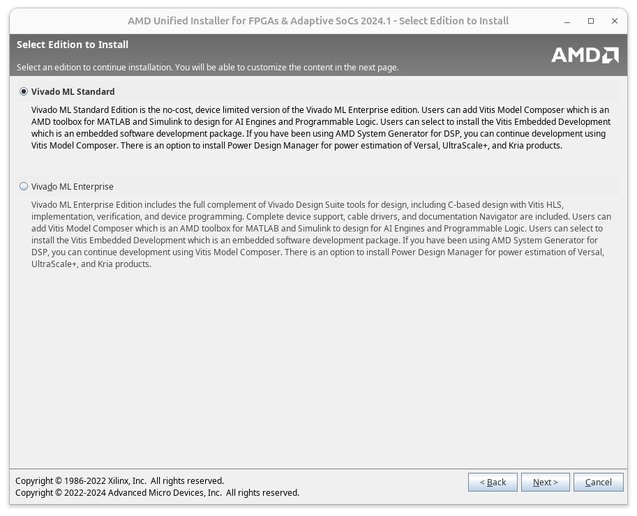
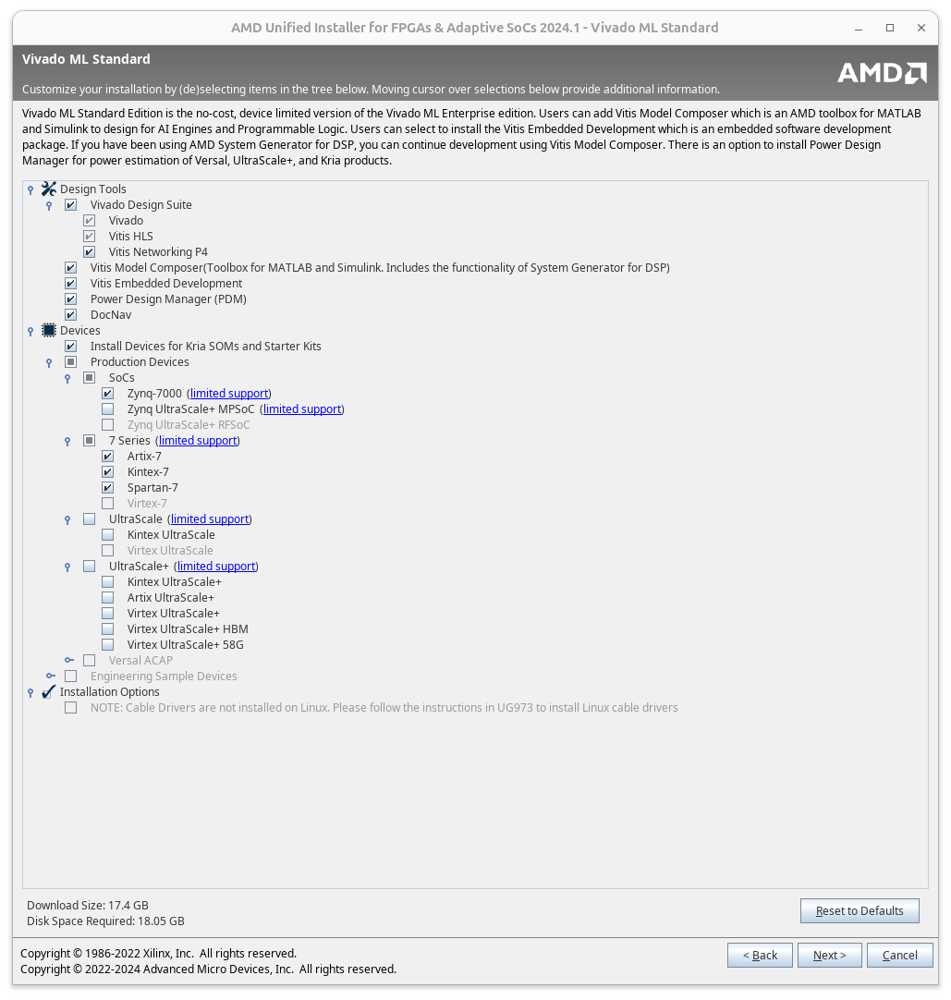
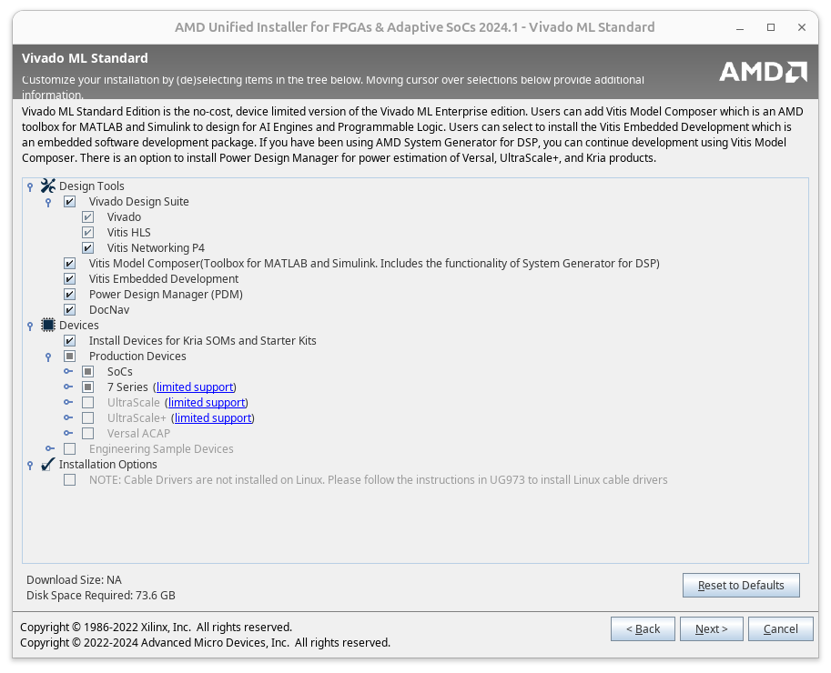
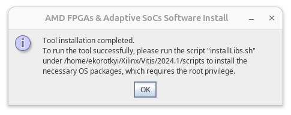

Below, I describe my experience installing Vivado 2024.1 on Ubuntu 24.04 LTS, including which library dependencies need to be installed for successful setup, how to download the installer from the AMD website by resolving export restrictions for Ukraine, and how to download only the necessary components instead of the full-sized installer. Let’s dive in.

# Installing Additional Libraries

You need to install the `libtinfo5`, `libncurses5`, and `libncurses5-dev` libraries, without which the Vivado installer will hang.

The issue is that these libraries are not included "out of the box" in the repositories for Ubuntu 24.04 LTS. To install them, you need to add the `universe` repository.

To add the `universe` repository, open the `ubuntu.sources` file:

```bash
sudo nano /etc/apt/sources.list.d/ubuntu.sources
```

At the end of the file, add:

```
Types: deb
URIs: http://archive.ubuntu.com/ubuntu/
Suites: lunar
Components: universe
Signed-By: /usr/share/keyrings/ubuntu-archive-keyring.gpg
```

Save the file and execute:

```bash
sudo apt update
```

Now install the required libraries:

```bash
sudo apt install libtinfo5 libncurses5-dev libncurses5
```

The above libraries were sufficient for me. However, others have reported needing to install additional packages such as `libncursesw5-dev`, `ncurses-compat-libs`, `libxrender1`, `libxtst6`, `libxi6`, `libfreetype6`, and `fontconfig`.

# Downloading the Vivado Installer

Log in to the AMD website: [https://login.amd.com/](https://login.amd.com/)

If you don’t have an account, create one. The process is straightforward: provide your name, surname, email (corporate email is not mandatory, gmail works too), and country of residence (I selected Ukraine). You will be asked to enter a verification code sent to your email to activate the account.

Go to the [Vivado download page](https://www.xilinx.com/support/download/index.html/content/xilinx/en/downloadNav/vivado-design-tools/2024-1.html) and select [AMD Unified Installer for FPGAs & Adaptive SoCs 2024.1: Linux Self Extracting Web Installer](https://www.xilinx.com/member/forms/download/xef.html?filename=FPGAs_AdaptiveSoCs_Unified_2024.1_0522_2023_Lin64.bin) (BIN - 291.7 MB).



Before downloading, you will need to provide your name, surname, email, address, and role (developer, educator, student, etc.). Some of the information may be pre-filled based on your account details. If your account specifies Ukraine as the country of residence, you may encounter an export compliance issue on your first attempt to download Xilinx/AMD products. In this case, you will need to fill out the [export-compliance-review](https://account.amd.com/en/forms/export-compliance-review.html) form.

In the [export-compliance-review](https://account.amd.com/en/forms/export-compliance-review.html) form, specify the page where the export compliance issue occurred (e.g., the download verification page: https://account.amd.com/en/forms/downloads/xef.html). Provide a brief explanation, such as being a student, educator, or developer in Kyiv who needs Vivado for educational purposes, and request export compliance approval.



Within 1-3 business days, your account should be approved for downloading Xilinx/AMD software, and you’ll receive a confirmation email. You can then retry downloading the [AMD Unified Installer for FPGAs & Adaptive SoCs 2024.1: Linux Self Extracting Web Installer](https://www.xilinx.com/member/forms/download/xef.html?filename=FPGAs_AdaptiveSoCs_Unified_2024.1_0522_2023_Lin64.bin).

# Installing Vivado

Grant execution permissions to the downloaded installer:

```bash
chmod +x FPGAs_AdaptiveSoCs_Unified_2024.1_0522_2023_Lin64.bin
```

Run the installer:

```bash
./FPGAs_AdaptiveSoCs_Unified_2024.1_0522_2023_Lin64.bin
```

In the pop-up window, log in using your AMD account credentials, choose "Download Image (Install Separately)" for Linux, and select "Selected Products Only." This allows you to download only the selected software components without downloading the full 100+ GB installer (for example, I downloaded ~17 GB instead of ~100 GB). If something goes wrong during installation, you can restart the process using the already downloaded files without re-downloading them (as would be the case with the "Download and Install Now" option). Also, specify the download location.



In the next window, choose Vivado or Vitis. I needed Vivado + HLS for student lab work, so I selected Vivado. If you need Vitis features, choose that option.



Select the type of Vivado installation. I chose the free "Vivado ML Standard" for lab work with the ZYBO Z7 board.



Choose which components to install. You can select all options or only those you plan to use. This affects the download size and final installation size. For example, if you don’t plan to work with UltraScale+ chips, you can save space by not selecting those components.



Click "Next" and then "Download" on the next screen.

Navigate to the downloaded files directory and run `xsetup`:

```bash
chmod +x xsetup
./xsetup
```

In the setup window, you may see a warning that your Linux version is not officially supported for Vivado installation. Since we’ve already installed the necessary libraries, click "Next" to proceed to the component selection screen. You likely won’t need to change anything here, as you’ve already selected the required components during the download.



In the next window, accept all license agreements, click "Next," and proceed to select the Vivado installation path.


In the final window, review the installation summary, and if everything is okay, click "Install."



Once the installation is complete, you’ll be prompted to run the `installLibs.sh` script located in the specified path. Run it as follows:

```bash
sudo ./installLibs.sh 
```

To install the programmer drivers, navigate to the directory `${vivado_install_dir}/data/xicom/cable_drivers/lin64/install_script/install_drivers/` and execute the `install_drivers` script:

```bash
cd ${vivado_install_dir}/data/xicom/cable_drivers/lin64/install_script/install_drivers/
./install_drivers
```

Here, `${vivado_install_dir}` is the path to the Vivado installation directory. Alternatively, you can use the full absolute path without the variable.

To launch Vivado, source the `settings64.sh` script from the installation directory and then run the Vivado command:

```bash
source settings64.sh
vivado
```

That’s it! Congratulations on installing Vivado!
