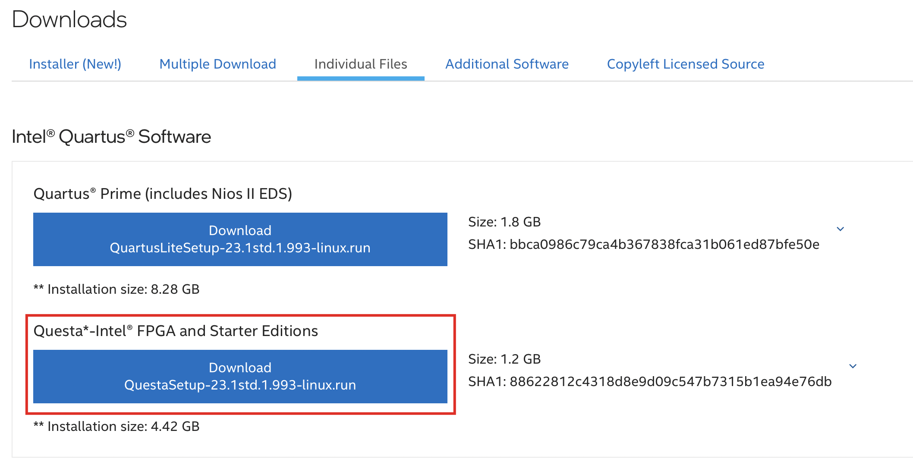
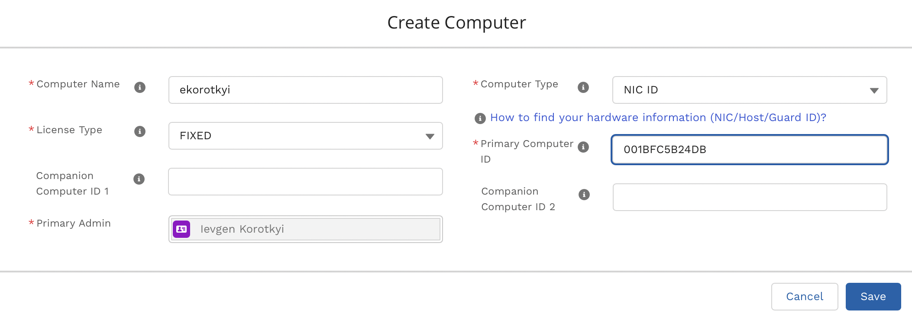
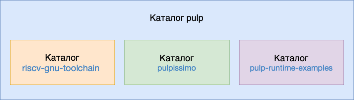
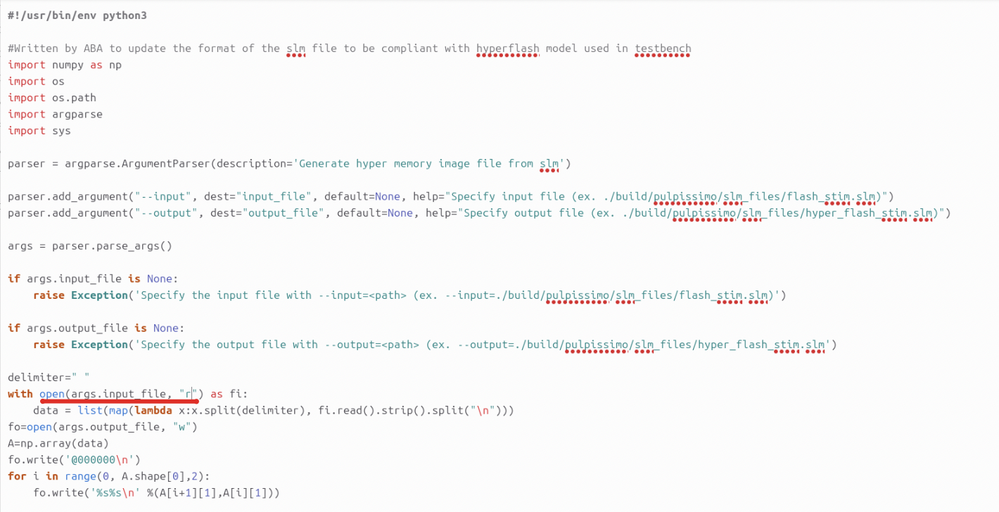
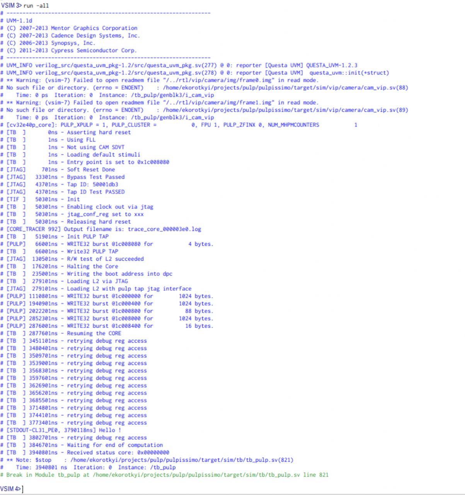

Нижче опишу послідовність кроків для симуляції системи на кристалі Pulpissimo з проекту PULP. 

Встановлення відбувається на Ubuntu 24.04.2 LTS. Версія Python: 3.12.3. Версія GCC: 13.3.0.

# Встановлюємо симулятор QuestaSim

За [посиланням](https://www.intel.com/content/www/us/en/software-kit/825277/intel-quartus-prime-lite-edition-design-software-version-23-1-1-for-linux.html)  викачуємо QuestaSim Intel FPGA Starter Edition для Linux. Я використав версію 23.1.1. Можна викачати і встановити окремо QuestaSim, а можна викачати весь Quartus Lite і разом з ним встановити QuestaSim. Я встановлював разом з Quartus Lite, але окремо QuestaSim від Intel теж має працювати.



Загалом процес встановлення проходить не складно. З підводних каменів відзначу, що встановити квесту не вийде на ARM Linux під Apple Silicon в Parallels. Це має бути суто x86 Linux.

Наступним кроком необхідно згенерувати ліцензію для QuestaSim від Intel/Altera.

На сайті Intel заходимо в [Intel® FPGA Self Service Licensing Center](https://licensing.intel.com/psg/s/?language=en) 


Якщо ви першийй раз заходите в центр ліцензій обираєте Enroll, інакше обираєте Sign In.


Далі обираєте [Sign up for Evaluation or No-Cost Licenses](https://licensing.intel.com/psg/s/sales-signup-evaluationlicenses)


Обираєте Questa*-Intel® FPGA Starter Edition (License: SW-QUESTA) і натискаєте внизу Next.


Ставите галочки, обираєте комп'ютер для якого генерується ліцензія, натискаєте Generate

 

Якщо жоден комп'ютер не заведений, натискаєте +New Computer. Обираєте тип ліцензії, вказуєте MAC адресу мережевої карти, натискаєте Save.



Ліцензія прийде на мейл на який ви реєструвались на порталі Intel.

В файлі .bashrc додаємо шлях до файлу з ліцензією в змінну оточення LM_LICENSE_FILE, а також додаємо в PATH шлях до бінарників QuestaSim:

```bash
export PATH=$PATH:/home/ekorotkyi/intelFPGA_lite/23.1std/questa_fse/bin
export LM_LICENSE_FILE="/home/ekorotkyi/intelFPGA_lite/23.1std/questa_fse/license/LR-218640_License.dat
```

Зберігаємо .bashrc і перзавантажуємо комп. Для запуску QuestaSim виконуємо з симулятора команду `vsim`. Якщо все пройшло по плану, вікно QuestaSim відкриється без помилок


# Структура каталогів

Для симуляції системи-на-кристалі Pulpissimo проекту PULP вам доведеться встановити:

1. Компілятор RISC-V GNU Toolchain (https://github.com/pulp-platform/riscv-gnu-toolchain)
2. Репозиторій системи-на-кристалі PULPissimo (https://github.com/pulp-platform/pulpissimo)
3. Приклади програм (репозиторій https://github.com/pulp-platform/pulp-runtime-examples)

Можна все це встановити в один каталог з назвою PULP



# Встановлення RISC-V GNU Toolchain

Рекурсивно клонуємо репозиторій компілятора (з клонуванням репозиторіїв-субмодулів)

```bash
git clone --recursive https://github.com/pulp-platform/riscv-gnu-toolchain.git
```

Встановлюємо бібліотеки

```bash
sudo apt-get install autoconf automake autotools-dev curl python3 libmpc-dev libmpfr-dev libgmp-dev gawk build-essential bison flex texinfo gperf libtool patchutils bc zlib1g-dev libexpat-dev
```

А також

```bash
sudo apt install python3-argcomplete python3-pyelftools python3-prettytable python3-numpy
```

Задаємо змінну оточення PULP_RISCV_GCC_TOOLCHAIN, яка вказує шлях куди буде встановлено зкомпільований компілятор і додаємо цей шлях в PATH. Робимо це в файлі .bashrc

```bash
export PULP_RISCV_GCC_TOOLCHAIN=/home/ekorotkyi/projects/pulp/riscv-gcc-toolchain
export PATH=$PULP_RISCV_GCC_TOOLCHAIN/bin:$PATH
```

Для налаштування конфігурації в каталозі компілятора виконуємо

```bash
./configure --prefix=$PULP_RISCV_GCC_TOOLCHAIN --with-arch=rv32imfcxpulpv3 --with-abi=ilp32 --enable-multilib
```

Для встановлення шляху де буде розміщений зкомпільований компілятор використовуємо `--prefix`. Для вибору архітектури процесора використовуємо `--prefix`.

Командою `make` запускаємо компіляцію. Процес компіляції тривалий (30-60 хв). Для пришвидшення можемо при виклику make задати кількість потоків для виконання компіляції `make -j16`

# Компіляція PULPissimo

Рекурсивно клонуємо репозиторій 

```bash
git clone --recursive https://github.com/pulp-platform/pulpissimo.git
```

Підвантажуємо репозиторії складових частин системи-на-кристалі використовуючи Bender

```bash
make checkout
```

Обираємо для якого процесора створювати програмні драйвери

```bash
cd sw/pulp-runtime

source configs/pulpissimo_cv32.sh
```

Далі з каталогу Pulpissimo виконуємо `make build`, що запускає процес компіляції SoC для симуляції та компіляцію бібліотеки драйверів. У підсумку отримаєте таке повідомлення з змінними оточення, які необхідно визначити. В моєму випадку було так

```
export VSIM_PATH=/home/ekorotkyi/projects/pulp/pulpissimo/build/questasim

export VSIM="vsim"
```

В кінці робимо мінорний фікс в файлі pulpissimo/sw/pulp-runtime/bin/slm_hyper.py

Підкреслена частина має виглядати, як на скріншоті нижче



# Симуляція прикладів з PULP Runtime Examples

Клонуємо проект

```bash
git clone https://github.com/pulp-platform/pulp-runtime-examples.git
```

Для запуску симуляції в терміналі виконуємо

```bash
cd hello 
make clean 
make all 
make run
```

Наведену вище послідовність команд необхідно виконувати щоразу для перезапуску симуляції (недостатньо просто виконати `make run`)

Якщо хочемо симулювати в GUI QuestaSim, остання команда повинна мати вигляд `make run gui=1`

В підсумку отримуємо таке

