# Вступ

Нижче опишу, як зібрати [pulp-sdk](https://github.com/pulp-platform/pulp-sdk) для системи-на-кристалі [Pulpissimo](https://github.com/pulp-platform/pulpissimo), скомпілювати приклади прискорення задач машинного навчання з репозиторію [pulp-training](https://github.com/pulp-platform/pulp-training/) і запустити симуляцію в QuestaSim. 

Спершу кілька слів про PULP. 

[PULP](https://pulp-platform.org/projectinfo.html) (Parallel Ultra Low Power) – розроблена в ETH Zurich відкрита платформа для створення енергоефективних систем-на-кристалі для паралельних обчислень на базі процесорів RISC-V архітектури. Це один з найвідоміших open source проектів у світі. Більше 50-ти [виготовлених чипів](https://pulp-platform.org/implementation.html). Можливість додавати не лише процесорні ядра, а і кастомні апаратні прискорювачі. Підтримуються реалізації RISC-V на 32 і на 64 біта. Підтримується можливість програмування на C, C++, OpenMP, OpenCL. Можливо працювати з bare metal, Linux, FreeRTOS. Готові інструменти для деплою нейромереж. 

Pulpissimo – відносно проста однопроцесорна система-на-кристалі, з якої зручно починати знайомитись з PULP. Pulpissimo можна запускати на рівнях cycle accurate / RTL симуляцій, а також на FPGA. Це silicon proven система, існує ряд виготовлених ASIC чіпів.

В даній статті розберемося, як встановити безкоштовну версію QuestaSim (від Intel/Altera), зібрати платформу Pulpissimo, а також RISC-V крос-компілятор і SDK для створення програм. Розглянемо, як запустити на симуляцію в QuestaSim приклад програми склярного добутку масивів, що прискорюється за рахунок апаратних розширень RISC-V процесора.

> [!IMPORTANT]
>
> Для встановлення pulpissimo та pulp-sdk, що підримують приклади використані в pulp-training, необхідні Python 2.7.17, Python 3.6.9, gcc 5.5.0. Найпростіше встановлення проходить в Ubuntu 18. Тому всі наступні інструкції орієнтовані на Ubuntu 18.

# Встановлення симулятора QuestaSim

За [посиланням](https://www.intel.com/content/www/us/en/software-kit/825277/intel-quartus-prime-lite-edition-design-software-version-23-1-1-for-linux.html)  викачуємо QuestaSim Intel FPGA Starter Edition для Linux. В даному випадку використана версія 23.1.1. Можна викачати і встановити окремо QuestaSim, а можна викачати весь Quartus Lite і разом з ним встановити QuestaSim.


Процес встановлення проходить не складно. З підводних каменів можна відзначити, що встановити квесту не вийде на ARM Linux під Apple Silicon в Parallels. Це має бути суто x86 Linux.

Наступним кроком необхідно згенерувати ліцензію для QuestaSim від Intel/Altera.

На сайті Intel заходимо в [Intel® FPGA Self Service Licensing Center](https://licensing.intel.com/psg/s/?language=en) 


Якщо ви перший раз заходите в центр ліцензій обираєте Enroll, інакше обираєте Sign In.


Далі обираєте [Sign up for Evaluation or No-Cost Licenses](https://licensing.intel.com/psg/s/sales-signup-evaluationlicenses)


Обираєте Questa*-Intel® FPGA Starter Edition (License: SW-QUESTA) і натискаєте внизу Next.

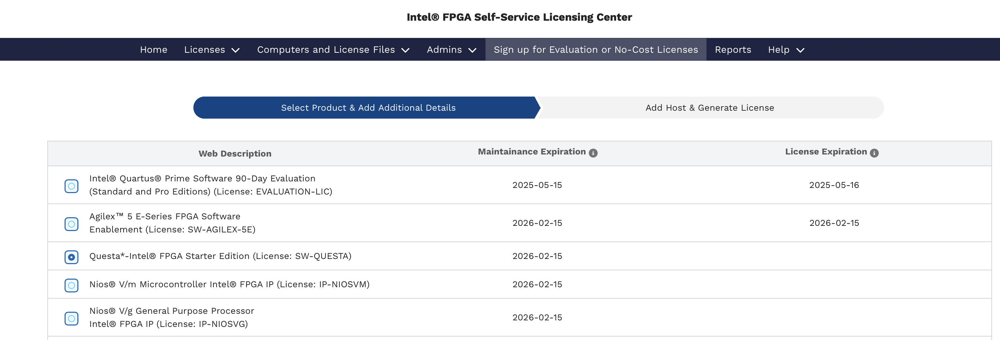

Ставите галочки, обираєте комп'ютер для якого генерується ліцензія, натискаєте Generate

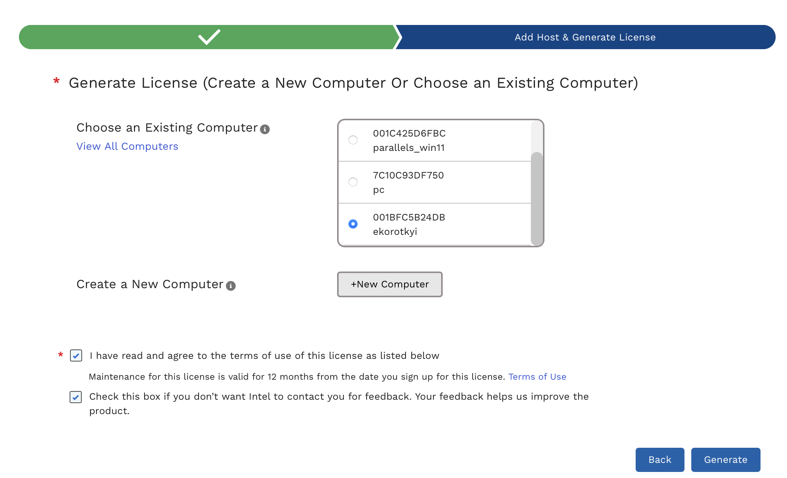

Якщо жоден комп'ютер ще не доданий, натискаєте +New Computer. Обираєте тип ліцензії, вказуєте MAC адресу мережевої карти, натискаєте Save.


Ліцензія прийде на мейл на який ви реєструвались на порталі Intel.

В файлі .bashrc додаємо шлях до файлу з ліцензією в змінну оточення LM_LICENSE_FILE, а також додаємо в PATH шлях до бінарників QuestaSim (це мають бути повні абсолютні шляхи, інакше ліцензія може не підтягнутись):

```bash
export PATH=$PATH:/home/pulp/intelFPGA/23.1std/questa_fse/bin
export LM_LICENSE_FILE=/home/pulp/intelFPGA/23.1std/questa_fse/license/LR-218640_License.dat
```

Зберігаємо .bashrc і перезавантажуємо комп'ютер. Для запуску QuestaSim виконуємо з терміналу команду `vsim`. Якщо все пройшло по плану, вікно QuestaSim відкриється без помилок.

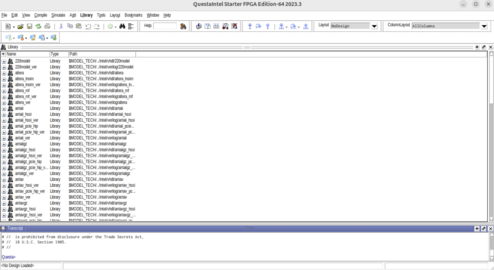

# Встановлення pulpissimo та pulp-sdk

> [!IMPORTANT]
>
> Нагадування, що встановлення відбувається на Ubuntu 18.

Встановлюємо і обираємо для роботи gcc 5.5:

```bash
sudo apt install gcc-5 g++-5

sudo update-alternatives --install /usr/bin/gcc gcc /usr/bin/gcc-5 100
sudo update-alternatives --install /usr/bin/g++ g++ /usr/bin/g++-5 100

sudo update-alternatives --config gcc
sudo update-alternatives --config g++
```

Перевіряємо, що версії gcc та g++ справді 5.5:

```bash
gcc --version
g++ --version
```

Має бути наступний результат:

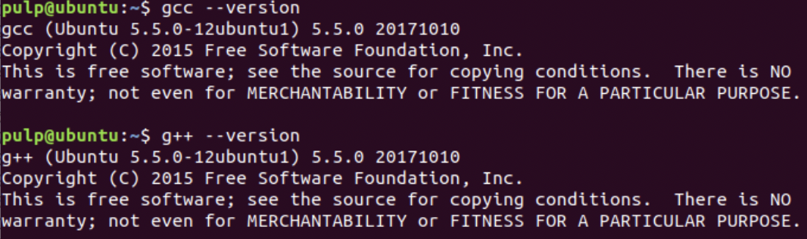

Встановлюємо залежності:

```bash
sudo apt install git curl gawk python3-pip python-pip autoconf automake autotools-dev build-essential bison flex texinfo gperf libtool patchutils bc zlib1g-dev libgmp-dev libmpfr-dev libmpc-dev swig3.0 libjpeg-dev lsb-core doxygen python-sphinx sox graphicsmagick-libmagick-dev-compat libsdl2-dev libswitch-perl 
libftdi1-dev cmake scons libsndfile1-dev tcl

sudo pip3 install artifactory twisted prettytable sqlalchemy pyelftools 'openpyxl==2.6.4' xlsxwriter pyyaml numpy configparser pyvcd semver

sudo pip2 install configparser
```

Будемо встановлювати крос-компілятор RISC-V, pulpissimo та pulp-sdk в каталог `~/pulp_box`:

```bash
cd ~
mkdir pulp_box
cd pulp_box
```

Рекурсивно (разом з сабмодулями) клонуємо pulp-riscv-gnu-toolchain (крос-компілятор RISC-V):

```bash
git clone --recursive https://github.com/pulp-platform/pulp-riscv-gnu-toolchain.git
```

Встановлюємо необхідні змінні оточення в .bashrc:

```bash
export PULP_RISCV_GCC_TOOLCHAIN=/home/pulp/pulp_box/pulp-riscv-gcc-toolchain
export PATH=$PULP_RISCV_GCC_TOOLCHAIN/bin:$PATH
```

Після правки .bashrc перезапускаємо термінал.

Конфігуруємо і компілюємо pulp-riscv-gnu-toolchain (компіляція довга і може тривати 30-90 хв):

```bash
cd pulp-riscv-gnu-toolchain/
./configure --prefix=$PULP_RISCV_GCC_TOOLCHAIN --with-arch=rv32imc --with-cmodel=medlow --enable-multilib
make
```

Встановлюємо pulpissimo та pulp-sdk в каталог `~/pulp_box`:

```bash
cd ~/pulp_box
```

Клонуємо pulpissimo та обираємо необхіднй реліз (який підтримує роботу з pulp-sdk):

```bash
git clone https://github.com/pulp-platform/pulpissimo.git
cd pulpissimo
git checkout v7.0.0
```

Компілюємо pulp-sdk:

```bash
make build-pulp-sdk
```

Клонуємо компоненти pulpissimo:

```bash
source env/pulpissimo.sh
make checkout
```

Для можливості роботи з новою версією QuestaSim виправляємо вміст файлу `sim/tcl_files/rtl_vopt.tcl`. Необхідно замінити `vopt +acc=mnpr` на `vopt +acc`. Необхідний вигляд файлу:

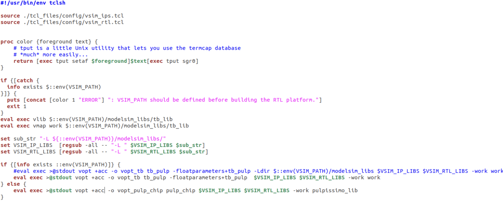

Нарешті компілюємо pulpissimo:

```bash
make build
```

# Запуск прикладів з репозиторію pulp-training

Клонуємо репозиторій [pulp-training](https://github.com/pulp-platform/pulp-training) з прикладами для pulp-sdk в каталог pulp_box:

```bash
cd ~/pulp_box/
git clone https://github.com/pulp-platform/pulp-training.git
```

Для демонстрації будемо використовувати приклад dot_product.

Для початку роботи відкриваємо термінал і ініціалізуємо pulp-sdk шляхом виконання pulpissimo.sh (даний скрипт необхідно запускати щоразу після запуску нового терміналу в якому ви зібрались працювати):

```bash
source ~/pulp_box/pulpissimo/env/pulpissimo.sh
```

Піся виконання скрипта по замовчуванню в якості цілі обирається симуляція в QuestaSim.

Тип виконання можна перевірити переглянувши вміст змінної оточення PULP_CURRENT_CONFIG_ARGS (platform=rtl відповідає симуляції в QuestaSim):

```bash
echo $PULP_CURRENT_CONFIG_ARGS
```

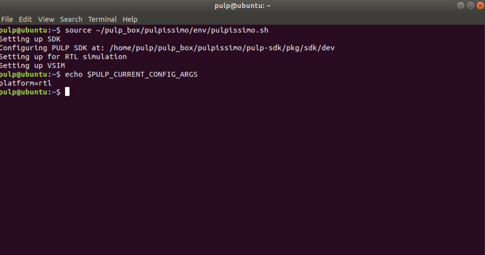

Для використання програмного cycle accurate симулятора GVSoC (це може корисно для пришвидшення симуляції, однак результати можуть відрізнятися від запуску на реальному процесорі в QuestaSim) необхідно виконати скрипт:

```bash
source ~/pulp_box/pulpissimo/pulp-sdk/configs/platform-gvsoc.sh
```

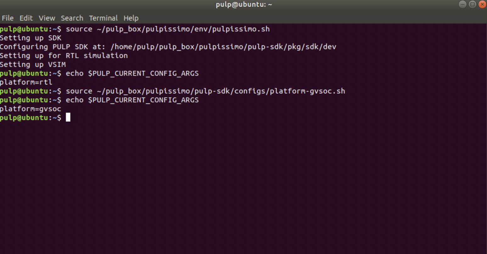

Для повернення до симуляції в QuestaSim необхідно виконати:

```bash
source ~/pulp_box/pulpissimo/pulp-sdk/configs/platform-rtl.sh
```

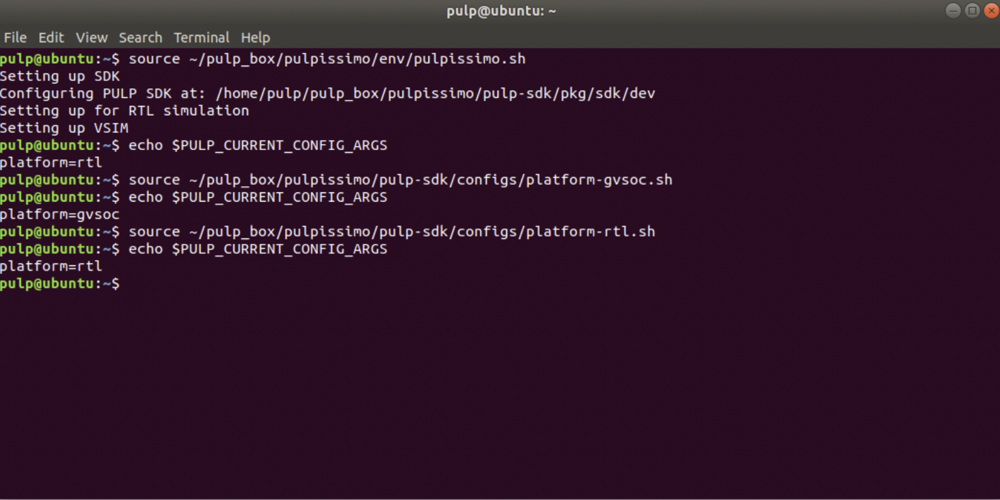

Переходимо в каталог dot_product і виконуємо:

```bash
cd ~/pulp_box/pulp-training/dot_product
make clean
make all
make run
```

Можна використати одну команду `make clean all run`

Команда `make clean` видаляє результати попередньої компіляції/симуляції.

Команда `make all` компілює програму для процесора.

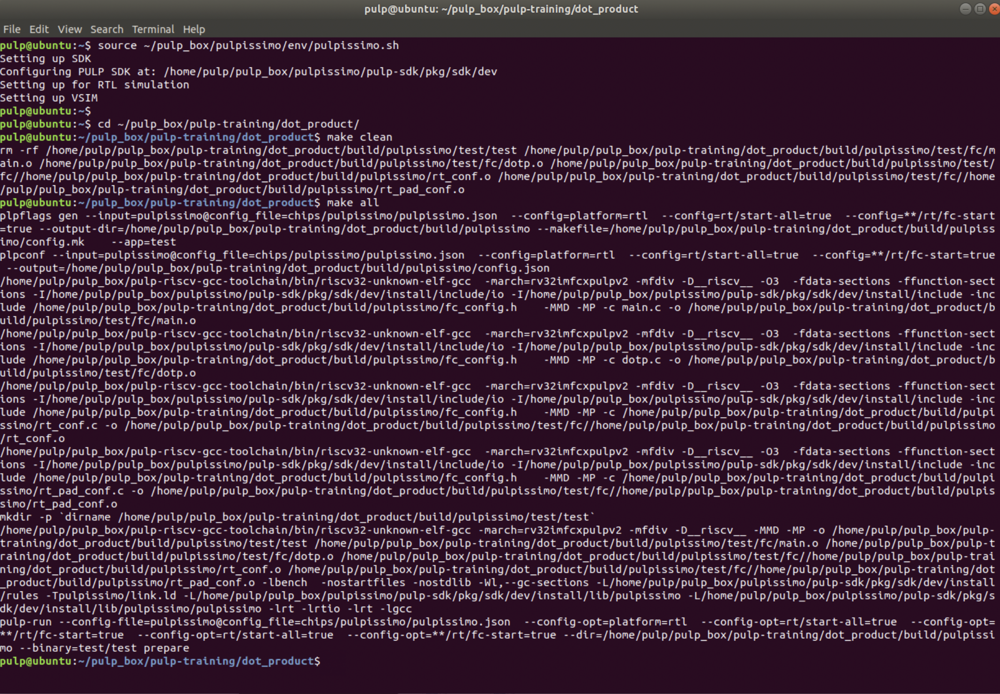

Команда `make run` запускає симуляцію.

У випадку успіху отримуємо такий результат:


Червоним кольором на рисунку вище виділені значення performance counters. Performance counters - це апаратні лічильники всередині pulpissimo, що дозволяють виконувати профайлінг (визначати скільки тактів системної частоти тривало виконання програми, скільки інструкцій виконано, скільки відбулося блокувань конвеєра, тощо). Більше про performance counters написано в наступному роздіді.

Аргументом для `make run` можна задати платформу для симуляції (GVSoC/QuestaSim).

Наприклад, запустити симуляцію на cycle accurate симуляторі GVSoC (це може корисно для пришвидшення симуляції, однак результати можуть відрізнятися від запуску на реальному процесорі в QuestaSim):

```bash
make run platform=gvsoc CORE=4
```

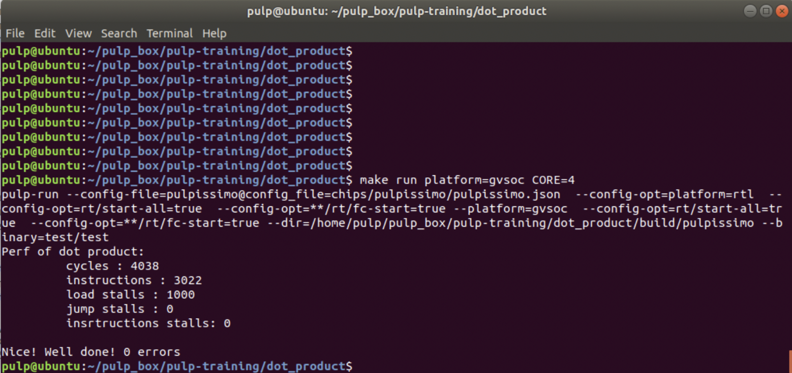

За допомогою аргументу CORE можна задати кількість ядер процесора вашого комп'ютера на якій буде виконуватись симуляція.

А так можна запустити симуляцію в QuestaSim явно задавши платформу rtl:

```bash
make run platform=rtl CORE=4
```

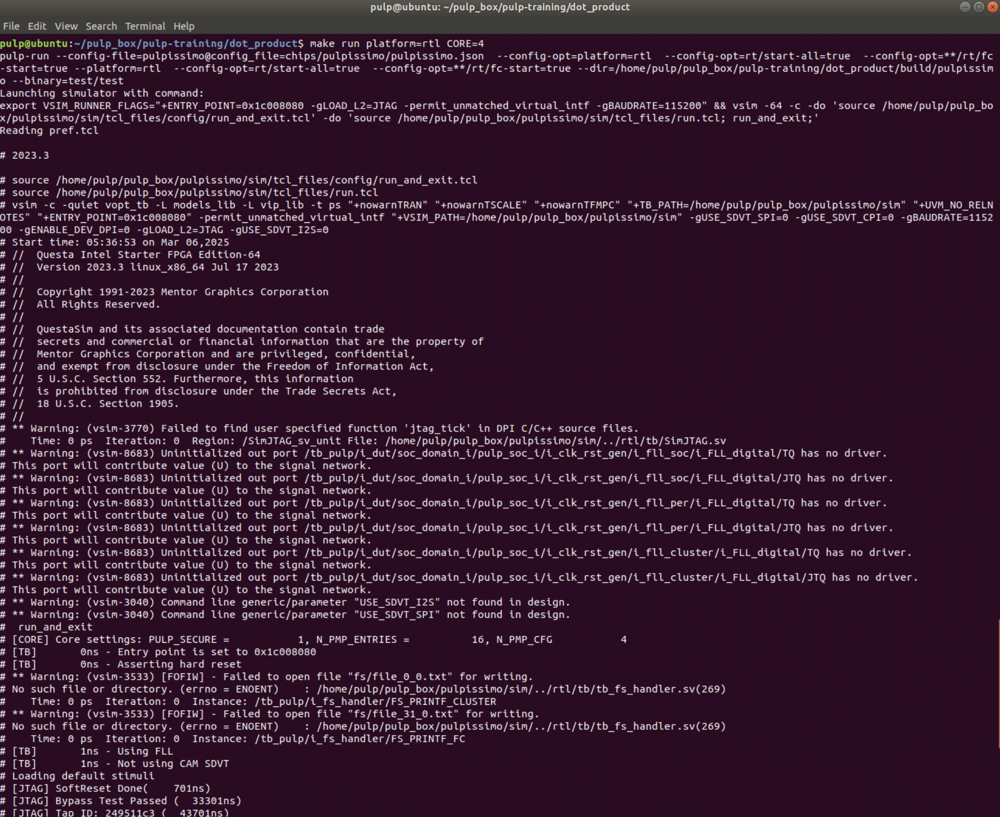

Існує можливість запустити симуляцію в графічному інтерфейсі QuestaSim:

```bash
make run gui=1
```

Після виконання команди відкриється вікно симулятора, однак симуляція не запуститься. Запустити симуляцію необхідно самостійно натиснувши кнопку `Run All`, або виконавши `run -all` в командному рядку QuestaSim.


Знаходячись в каталозі з прикладом можна дизасемблювати програму командою (результат дизасемблювання зберігається в файл dis.s):

```bash
make dis > dis.s
```

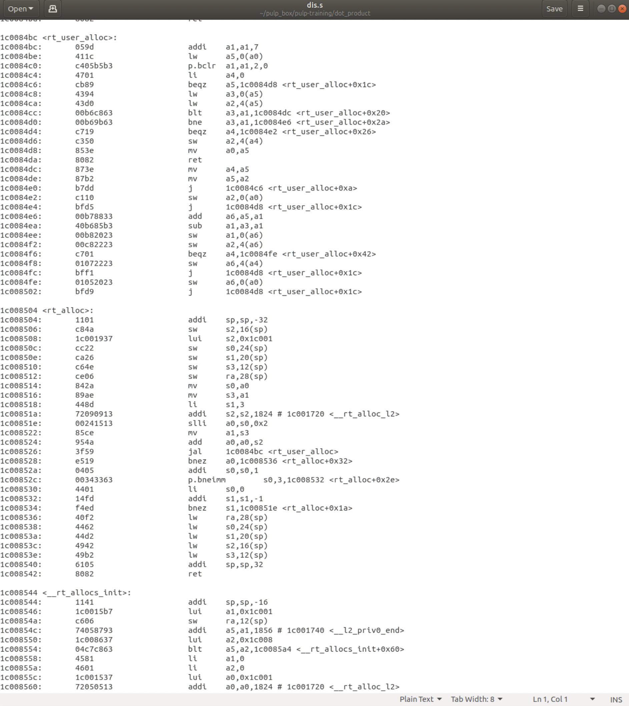

В файлі `/home/pulp/pulp_box/pulp-training/dot_product/build/pulpissimo/trace_core_1f_0.log` буде зберігатися результат виконання інструкцій з прив'язкою до моментів часу в симуляторі:


# Опис performance counters в pulp-sdk

Performance counters - це апаратні лічильники всередині pulpissimo (програмний доступ до яких підтрмано в pulp-sdk), що дозволяють виконувати профайлінг (визначати скільки тактів системної частоти тривало виконання програми, скільки інструкцій виконано, скільки відбулося блокувань конвеєра, тощо). 

Результат виводу performance counters для прикладу dot_products на момент завершення виконання програми: 

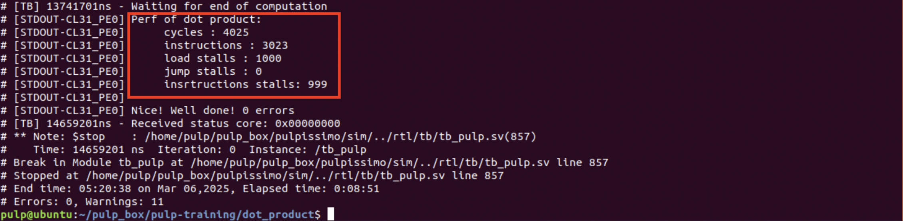

Розшифровка:

`cycles` -> кількість тактів системної частоти з моменту початку запуску performance counters

`instructions` -> кількість інструкцій, які виконав процесор з моменту початку запуску performance counters

`load stalls` -> кількість зупинок конвеєра процесора (з моменту початку запуску performance counters) пов'язаних з тим, що інструкція використовує значення регістру, яке ще не встигло вичитатись з памʼяті даних

`jump stalls` -> кількість бульбашок в конвеєрі процесора (з моменту початку запуску performance counters), які виникли внаслідок виконання інструкцій безумовного переходу

`instructions stalls` -> кількість зупинок конвеєра процесора (з моменту початку запуску performance counters) обумовлених вичитуванням інструкцій не вирівняних на границю 4 байти (ситуація може виникати при використанні стиснених інструкцій)

Більше про Performance counters (і трохи про зупинки конвеєра) можна почитати [тут](https://pulp-platform.org/docs/riscv_workshop_zurich/schiavone_wosh2019_tutorial.pdf) (слайд Performance Counter 1/3), а також в документації на pulp-sdk (файл `file:///home/pulp/pulp_box/pulpissimo/pulp-sdk/doc/dox/doc/runtime/html/group__Perf.html`). 

Приклад використання Performance counters:

```c
    rt_perf_t *perf;
    perf = rt_alloc(RT_ALLOC_L2_CL_DATA, sizeof(rt_perf_t));

    rt_perf_init(perf);
    rt_perf_conf(perf, (1<<RT_PERF_ACTIVE_CYCLES) | (1<<RT_PERF_INSTR) | (1<< RT_PERF_LD_STALL ) | (1<< RT_PERF_JR_STALL ) | (1 << RT_PERF_IMISS ) ) ;

    rt_perf_reset(perf);

    //start the monitoring
    rt_perf_start(perf);

    // Some code execution here ....    

    //stop the HW counter used for monitoring
    rt_perf_stop(perf);

    //get the total measurement
    rt_perf_save(perf);

    instr   = rt_perf_get(perf, RT_PERF_INSTR);
    cycles  = rt_perf_get(perf, RT_PERF_ACTIVE_CYCLES);
    ldstall = rt_perf_get(perf, RT_PERF_LD_STALL);
    jrstall = rt_perf_get(perf, RT_PERF_JR_STALL);
    imstall = rt_perf_get(perf, RT_PERF_IMISS);

    printf("Perf of dot product: \n \t cycles : %d \n \t instructions : %d \n \t load stalls : %d \n \t jump stalls : %d \n \t insrtructions stalls: %d \n\n", cycles, instr, ldstall, jrstall, imstall);
```

Опис варіантів Performance counters:


# Використання inline assembler для pulpissimo

В прикладах pulp-training основна програма написана на мові С (для зручності). Ключові обчислення натомість реалізовані на мові асемблера RISC-V (для демонстрації того, як розширення RISC-V можна використовувати для оптимізацій програм). 

Асемблер в С-програмах використовують за допомогою асемблерних вставок і ключого слова `asm`.

Для доступу з коду асемблерної вставки до змінних С-програми (щоб, наприклад, з коду на асемблері змінювати змінні С-програми) використовують наступний підхід:

```c
unsigned int dotproduct(unsigned int acc, unsigned char* vA, unsigned char* vB, unsigned int N)
{
    unsigned char elemA, elemB;
    // .. Some code here 
    asm volatile(
        "lp.setup x0,%[n_elem],stop_loop;"
        "p.lbu %[a], 1(%[addrA]!);"
        "p.lbu %[b], 1(%[addrB]!);"
        "stop_loop: p.mac %[c], %[a], %[b];"
        : [c] "+r" (acc), [a] "+r" (elemA), [b] "+r" (elemB), [addrA] "+r" (vA), [addrB] "+r" (vB) : [n_elem] "r" (N)
    );
    // .. Some code here 
}
```

Кваліфікатор `volatile` забороняє компілятору оптимізувати заданий асемблерний код.

Конструкція на зразок `[c] "+r" (acc)` повʼязує ім'я змінної в С-програмі (в даному випадку `acc`)  з символьним ім'ям, яке використовується в асемблері (в даному випадку символьне ім'я в асемблерному коді це `c`).

`"+r"` вказує, що відповідну змінну мови С необхідно зберігати в регістрі процесора. Знак `+` вказує, що можливе, як зчитування змінної, так і запис.

Для доступу до регістру з заданим символьним імʼям в асемблерному коді використовують конструкцію `%[asmSymbolicName]`. Для прикладу, в конструкції `p.lbu %[a], 1(%[addrA]!);` байт даних з комірки пам'яті заданої адресою в регістрі з символьним ім'ям `addrA` (містить значення вказівника `vA` С-коду) плюс зміщення 1 вичитується в регістр з символьним ім'ям `a` (відповідає змінній `acc` С-коду). 

Більше про інлайн асемблер можна почитати за [посиланням](https://gcc.gnu.org/onlinedocs/gcc/Extended-Asm.html).

# Корисні посилання

І на завершення кілька корисних посилань. Бажаю успіху в опануванні PULP!

1. [PULPissimo Datasheet](https://github.com/pulp-platform/pulpissimo/blob/master/doc/datasheet/datasheet.pdf)
2. [RI5CY User Manual](https://pulp-platform.org/docs/ri5cy_user_manual.pdf) (RI5CY - це процесорне ядро Pulpissimo)
3. [Туторіал про pulp-sdk](https://pulp-platform.org/docs/pulp_training/NBruschi_gvsoc_tutorial_part1.pdf)
4. [Туторіал про PULP](https://pulp-platform.org/docs/riscv_workshop_zurich/schiavone_wosh2019_tutorial.pdf)
5. [Стаття про PULP "Near-Threshold RISC-V Core With DSP Extensions for Scalable IoT Endpoint Devices"](https://arxiv.org/pdf/1608.08376)