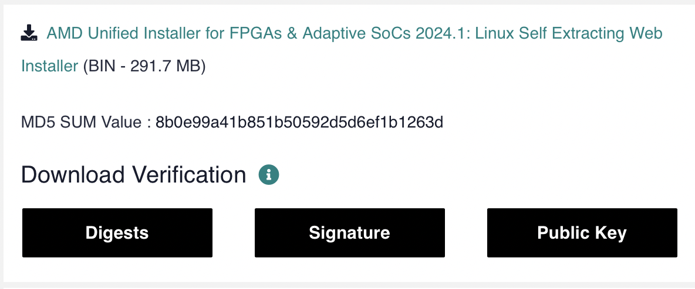
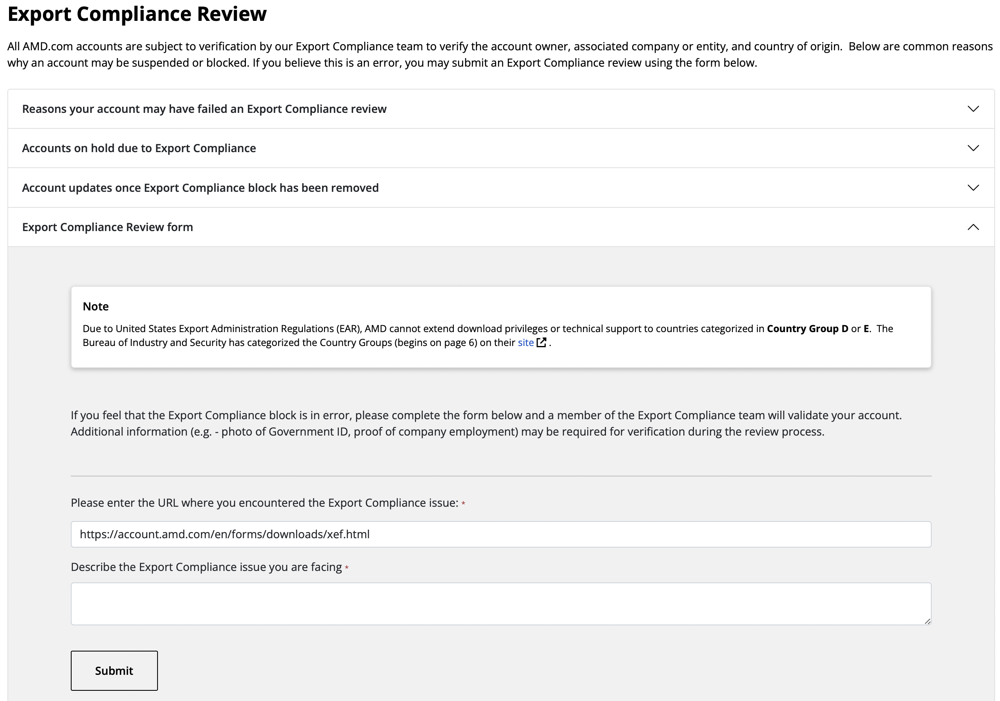
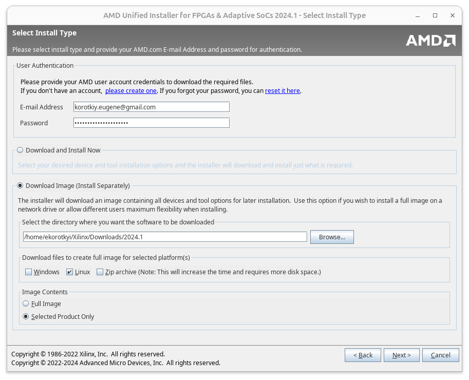
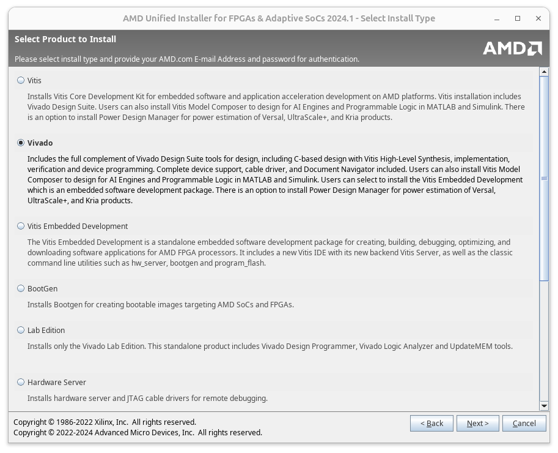
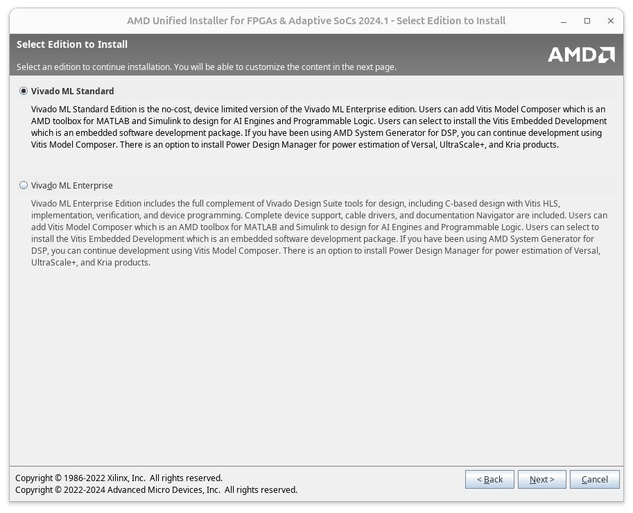
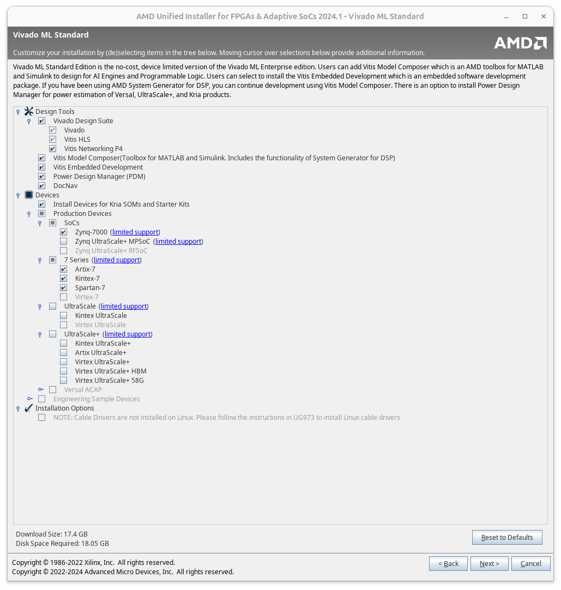
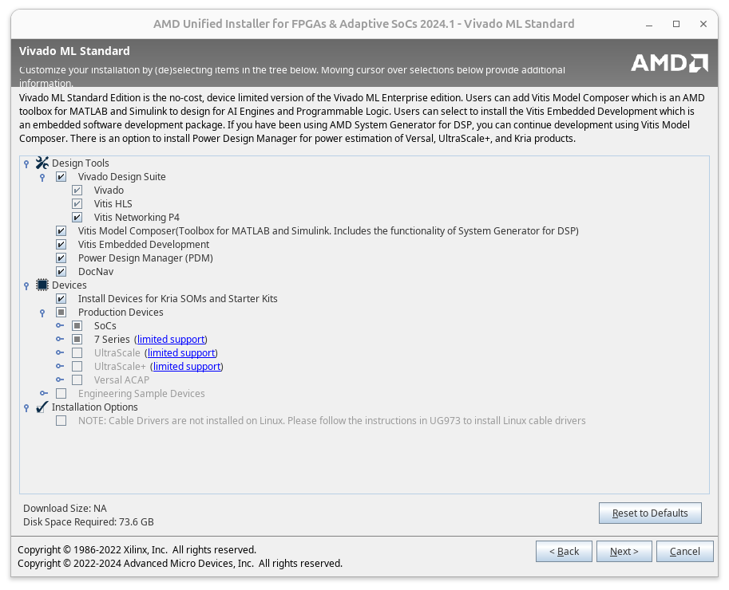
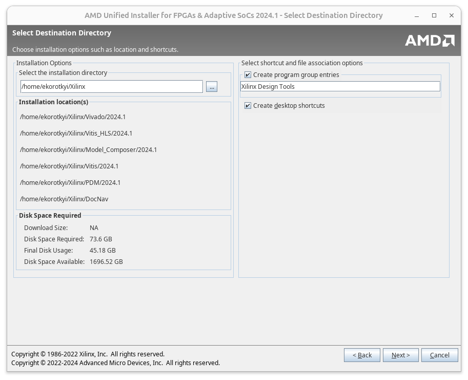
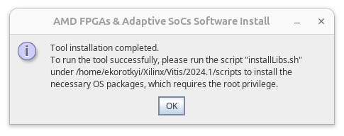

Нижче опишу досвід встановлення Vivado 2024.1 на Ubuntu 24.04 LTS, а саме: які ліби-залежності потрібно довстановити для коректної інсталяції, як завантажити інсталер з сайту AMD вирішивши проблему з експортними обмеженнями для України, а також як викачати лише необхідні компоненти замість завантаження 100500 ГБ повнорозмірного інсталятора. Погнали.

# Встановлюємо додаткові бібліотеки

Вам потрібно встановити ліби libtinfo5, libncurses5 та libncurses5-dev, без яких інсталятор Vivado зависатиме.

Проблема полягає у тому, що в репозиторіях Ubuntu 24.04 LTS "з коробки" згадані ліби відсутні. Відповідно вам необхідно додати репозиторій universe.

Щоб додати репозиторій universe, спершу відкриваєте файл ubuntu.sources:

```bash
sudo nano /etc/apt/sources.list.d/ubuntu.sources
```

В кінці файлу додаєте:

```
Types: deb
URIs: http://archive.ubuntu.com/ubuntu/
Suites: lunar
Components: universe
Signed-By: /usr/share/keyrings/ubuntu-archive-keyring.gpg
```

Зберігаєте файл і виконуєте:

```bash
sudo apt update
```

Тепер встановлюєте потрібні ліби:

```bash
sudo apt install libtinfo5 libncurses5-dev libncurses5
```

Згаданих вище ліб мені вистачило. Тим не менш знайомі стверджують, що їм довелось додатково встановити `libncursesw5-dev ncurses-compat-libs libxrender1 libxtst6 libxi6 libfreetype6 fontconfig`

# Викачуємо інсталятор Vivado

Логінитесь на сайті AMD https://login.amd.com/

Якщо не маєте акаунту, то створюєте його. Процес створення акаунту доволі простий: вас попросять ввести ім'я, прізвище, мейл (не обов'язково корпоративний мейл, gmail також підходить), країну проживання (вказував Україну). Далі попросять для активації акаунта ввести код перевірки, який надійшов на вказаний мейл.

Переходите на [сторінку завантаження Vivado](https://www.xilinx.com/support/download/index.html/content/xilinx/en/downloadNav/vivado-design-tools/2024-1.html), обираєте [AMD Unified Installer for FPGAs & Adaptive SoCs 2024.1: Linux Self Extracting Web Installer](https://www.xilinx.com/member/forms/download/xef.html?filename=FPGAs_AdaptiveSoCs_Unified_2024.1_0522_2023_Lin64.bin) (BIN - 291.7 MB).



Перед завантаженням файлу вас попросять ввести і'мя, прізвище, мейл, адресу та посаду (розробник, викладач, студент, тощо). Частина інфи може підтягнутися з даних акаунту і доведеться лише перевірити. Якщо у вас в акаунті вказана Україна, як країна проживання, досить імовірно, що при першій спробі завантаження програмних продуктів Xilinx/AMD ви отримаєте повідомлення, що завантаження неможливе доки ваш акаунт не пройде [export-compliance-review](https://account.amd.com/en/forms/export-compliance-review.html). 

В формі [export-compliance-review](https://account.amd.com/en/forms/export-compliance-review.html) вказуєте сторінку, на якій виникли проблеми з Export Compliance (це може бути сторінка перевірки особистих даних https://account.amd.com/en/forms/downloads/xef.html), а також пишете невеликий супровідний текст (наприклад, що ви студент/викладач/розробник, живете в Києві, хочете викачати Vivado для навчання, відповідно просите розблокувати завантаження програмних продуктів).



Протягом 1-3 робочих днів для вашого акаунту розблокують завантаження софта Xilinx/AMD, про що ви отримаєте листа на вказаний при реєстрації мейл. Після цього можна повторити спробу викачування [AMD Unified Installer for FPGAs & Adaptive SoCs 2024.1: Linux Self Extracting Web Installer](https://www.xilinx.com/member/forms/download/xef.html?filename=FPGAs_AdaptiveSoCs_Unified_2024.1_0522_2023_Lin64.bin).

# Інсталяція Vivado

Даємо викачаному інсталеру права на виконання:

```bash
chmod +x FPGAs_AdaptiveSoCs_Unified_2024.1_0522_2023_Lin64.bin
```

Запускаємо інсталер:

```bash
./FPGAs_AdaptiveSoCs_Unified_2024.1_0522_2023_Lin64.bin
```

У вікні, що зʼявилося, вводите реквізити вашого AMD акаунту, обираєте "Download Image (Install Separately)" для Linux та "Selected Products Only". Це дасть можливість завантажити лише обрані програмні компоненти не викачуючи 100500 ГБ повного інсталеру (для прикладу, в моєму випадку довелося викачати ~17 ГБ замість ~100 ГБ повного пакету). Якщо під час встановлення щось піде не так, ви зможете почати новий процес інсталяції з уже завантажених файлів, без повторного їх викачування (як було б у випадку використання "Download and Install Now"). Також вказуємо куди викачувати файли.



У наступному вікні обираєте Vivado, або Vitis. Мене цікавило встановлення Vivado + HLS для студентських лабораторних робіт, тому обрав Vivado. Якщо потрібні фічі Vitis, обираєте відповідну опцію.



Обираєте тип Vivado для встановлення. Мене цікавила безкоштовна версія Vivado для лабораторних робіт на платі ZYBO Z7, тож обрав "Vivado ML Standard"



Обираєте, які компоненти встановлювати. Можна обрати всі опції, можна обрати лише ті, якими будете користуватись. Це впливає на розмір викачуваних файлів і на обʼєм фінальної інсталяції. Якщо, наприклад, ви не плануєте працювати на чіпах UltraScale+, можна зекономити місце і не обирати ці компоненти. 



Натискаєте Next і на наступному слайді натискаєте Download.

Переходимо в каталог з викачаними файлами і запускаємо xsetup:

```bash
chmod +x xsetup
./xsetup
```

У вікні, що відкриється, вас попередять, що версія Linux не підходить для встановлення Vivado. Але ми встановили необхідні ліби, тож все ОК, натискаємо Next і переходимо до вікна вибору компонентів для встановлення. На цьому вікні ви зможете обрати, які з викачаних компонентів встановлювати. Скоріше за все вам тут нічого змінювати не доведеться, оскільки необхідні компоненти ви обрали під час викачування:



Наступне вікно присвячене ліцензійним угодам. Ставите всі галочки "I agree", натискаєте Next і переходите у вікно вибору шляху встановлення Vivado:



У останньому вікні отримуєте загальну інформацію про інсталяцію і якщо все ОК, натискаєте Install.

 

По завершенню інсталяції вам запропонують довстановити ще кілька необхідних бібліотек виконавши installLibs.sh, який знаходиться за вказаним шляхом. Це також варто зробити: 

```bash
sudo ./installLibs.sh 
```

Для встановлення драйверів програматорів переходите в каталог `${vivado_install_dir}/data/xicom/cable_drivers/lin64/install_script/ install_drivers/`  і виконуєте там `install_drivers`:

```bash
cd ${vivado_install_dir}/data/xicom/cable_drivers/lin64/install_script/ install_drivers/

./install_drivers
```

Змінна `${vivado_install_dir}` містить шлях до каталогу, куди ви встановили Vivado. Звісно можна вказати абсолютний повний шлях при переході в каталог `install_script`, не використовуючи змінну.

Для запуску Vivado виконуєте скрипт settings64.sh з каталогу, куди встановили Vivado, а далі, команду запуску Vivado:

```bash
source settings64.sh
vivado
```

На цьому все. Вітаю, ви встановили Vivado!